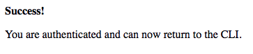

### Start login flow

Run the command:

```
goliothctl login
```

This will redirect you to your default browser where you can login or create an account on our system.

### Create account or login with an existing one

After successfully authenticating into our system, you should be redirected to a success page and the CLI will be authenticated properly.


