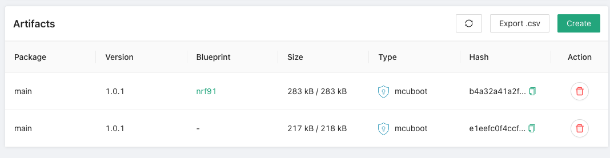

On the device side, our [Zephyr SDK](https://github.com/golioth/zephyr-sdk) relies on MCUboot, an open source bootloader. Our backend also knows how to detect MCUboot compatible images when a artifact is created/uploaded and reads MCUboot metadata like signed version, internal image hash and so on. This makes our solution more robust and reliable, as we can guarantee that the image is compatible with MCUboot.

:::note
You can find more information about MCUboot in the [MCUboot Github Repository](https://github.com/mcu-tools/mcuboot).
:::

We provided a [sample application](https://github.com/golioth/zephyr-sdk/tree/main/samples/dfu) that can be used to test our DFU service. That sample listens for new releases notifications from our backend and automatically downloads and installs them with MCUboot.

Follow the guide to run the sample application on your target board, and follow the steps below to upload your artifacts. After pushing the initial firmware locally, we can build it again and sign it with the `west` tool. Signing is really important, as this is how MCUboot can check if the device is running the desired version.

Here are the steps to build and sign your image with version `1.0.1` and both will save the image on path `./build/zephyr/app_update.bin`:

- For Nordic Zephyr SDK and the nrf9160 Feather board

```
$ west build -b circuitdojo_feather_nrf9160ns samples/dfu -p -- -DCONFIG_MCUBOOT_IMAGE_VERSION=\"1.0.1\"
```

- For Pure Zephyr SDK and a nrf52840-dk board

```
$ west build -b nrf52840dk_nrf52840 samples/dfu -p
$ west sign -t imgtool --no-hex -B ./build/zephyr/app_update.bin -- --key ../../../bootloader/mcuboot/root-rsa-2048.pem --version 1.0.1
```

Them you can upload to our backend using the following command:

```
# assuming you have a blueprint name nrf91
$ goliothctl dfu artifact create ./build/zephyr/app_update.bin --version 1.0.1 --blueprint nrf91
# Withouth a blueprint
$ goliothctl dfu artifact create ./build/zephyr/app_update.bin --version 1.0.1
```

Now you can check on our Web Console the uploaded artifacts and see the version `1.0.0` in the list.



Or you can also check with `goliothctl dfu artifact list`:

```
$ goliothctl dfu artifact list
id:"616880956c69662e1083286f" version:"1.0.1" package:"main" size:283446 blueprint:"nrf91" binaryInfo:map[digests:map[sha256:map[digest:b4a32a41a2f61221e9f1148e778f8d6406beea3ab9b854e929e4b34945fff578 size:32 type:sha256]] headerSize:512 imageSize:282784 tlvTotalSize:150 type:mcuboot version:1.0.1]
id:"6168783e6c69662e1083286a" version:"1.0.1" package:"main" size:217724 binaryInfo:map[digests:map[sha256:map[digest:e1eefc0f4ccf30635bad2079f154f662f80b294c3be03ca7605edcf13bc9e9f4 size:32 type:sha256]] headerSize:512 imageSize:216876 tlvTotalSize:336 type:mcuboot version:1.0.1]
```
