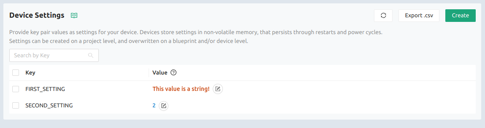
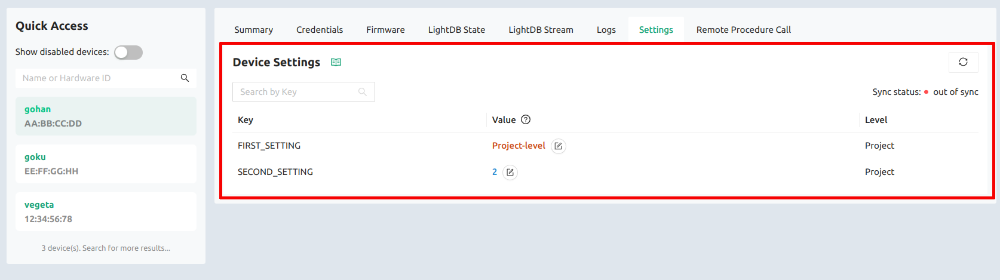

There are three distinct places in the Golioth Console to work with Settings
service values: the project-level, the blueprint-level, and the device-level.

:::tip Creating a new setting

Remember that a new setting can only be created at the project-level.

:::

## Project-level settings

Project-level settings are easily found in the main page of the Golioth Console.
Click on `Device Settings` in the left side bar menu to open the project-level
settings listing:

Here you can see two settings keys (`FIRST_SETTING` and `SECOND_SETTING`). The
`Create` button in the upper right is used to add new settings.

This interface may be used to delete a setting by first selecting the check box
to the right of it and then clicking on the `Delete Selected` button that
appears.

## Blueprint-level settings

Blueprint-level settings are adjusted from the details section of a specific
blueprint. Click the `Blueprints` entry on the left sidebar menu and choose the
desired blueprint:

At the blueprint details page you can find the `Device Settings` section with
all the settings applicable to that blueprint:

In this view, the `Level` column indicates which level of the settings hierarchy
is responsible for the settings value. We can see that the `SECOND_SETTING` has
been updated at the `Blueprint` level. The garbage-can icon next to the setting
can be used to remove this override, restoring the project-level value in the
process.

## Device-level settings

Device-level settings are found on the details tab of a specific device. Click
on `Devices` from the left sidebar menu. Choose the desired device, then click
on the `Settings` tab:

Once again, the `Level` column indicates which level of the settings hierarchy
is responsible for the settings value. We can see that the `SECOND_SETTING` has
been overridden at the `Device` level and this value will only affect the device
you're currently viewing. The garbage-can icon next to the setting can be used
to remove this override, restoring the project-level/blueprint-level
inheritance.
