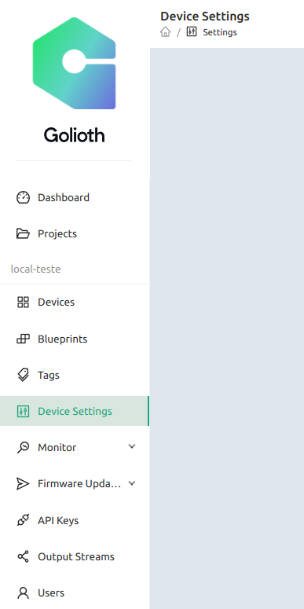
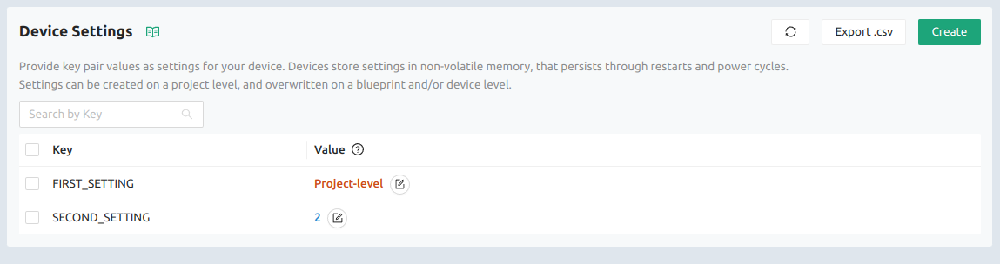
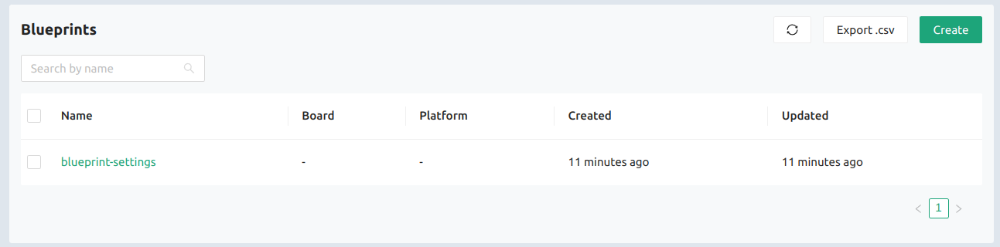
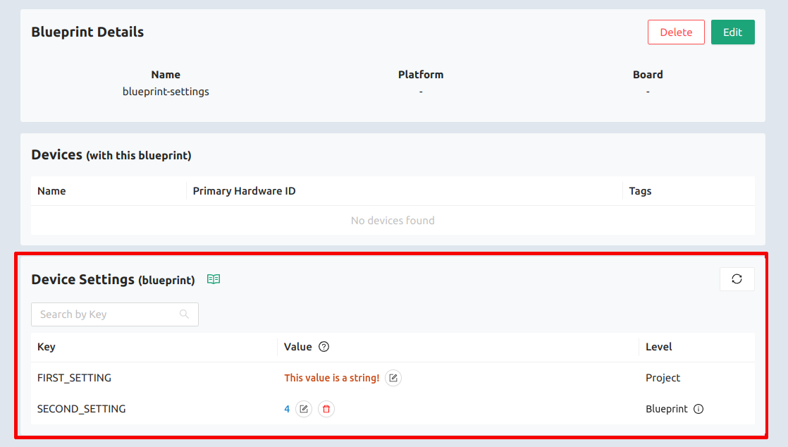
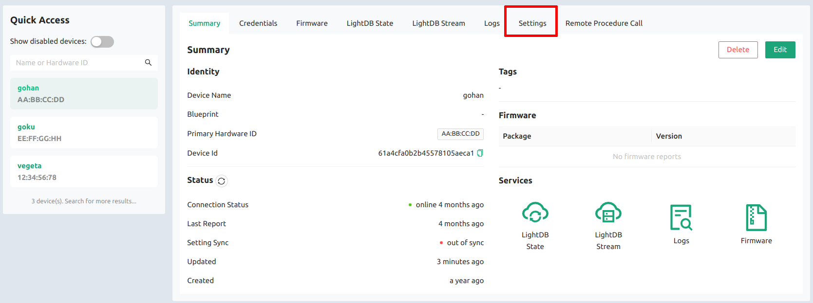
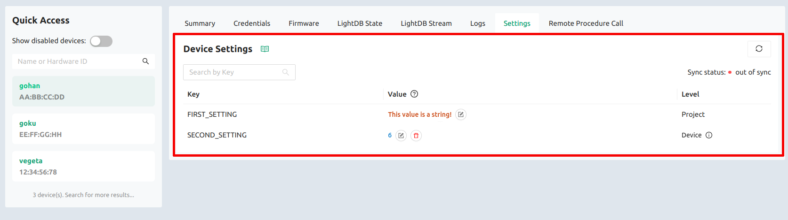

Before creating new settings, let's understand where to find them when they are created.

Next we'll see the project-level, the blueprint-level and the device-level settings locations.

### Project-level settings location

Project-level settings are easily find in the main page of the Golioth Platform as `Device Settings` at the side bar:

Click on that to open the project-level settings listing:

These are just mock settings to be used on this documentation

### Blueprint-level settings location

Blueprint-level settings are easily find as a details of a specific blueprint, so go to the `Blueprints` page and choose the blueprint you want to see details:

At the blueprint details page you can find the `Device Settings` section with all the settings applicable to that blueprint as follow:

### Device-level settings location

Device-level settings are easily find as a details of a specific device, so go to the `devices` page and choose the device you want to see details. At the device  details page you can find the `Settings` tab, where will open all the settings applicable specifically to that device as follow:

