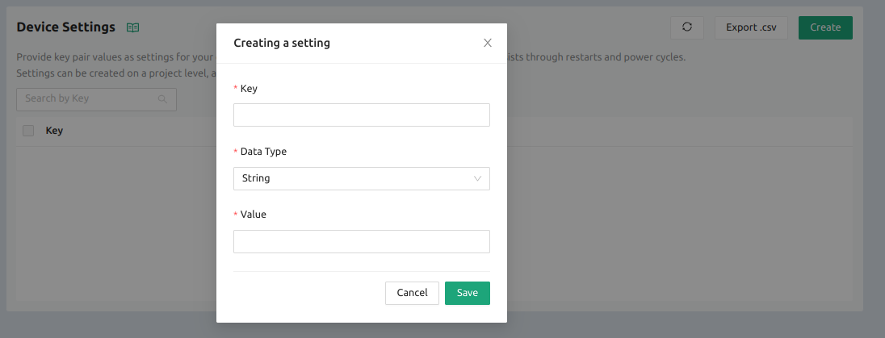
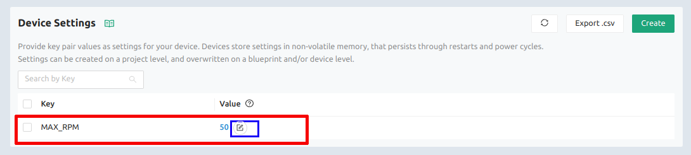
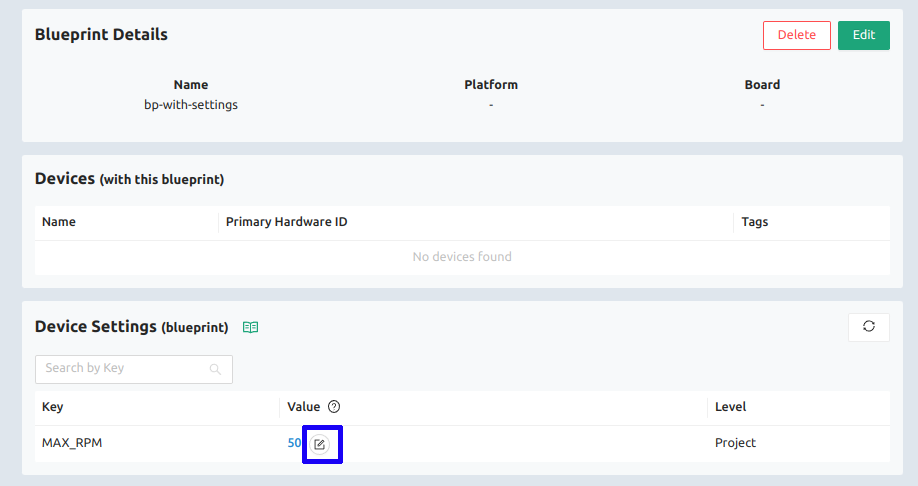
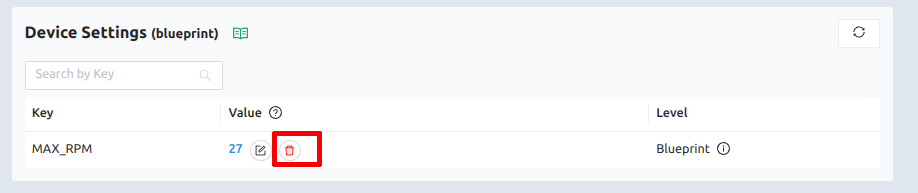
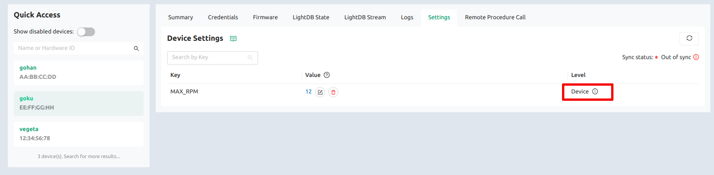
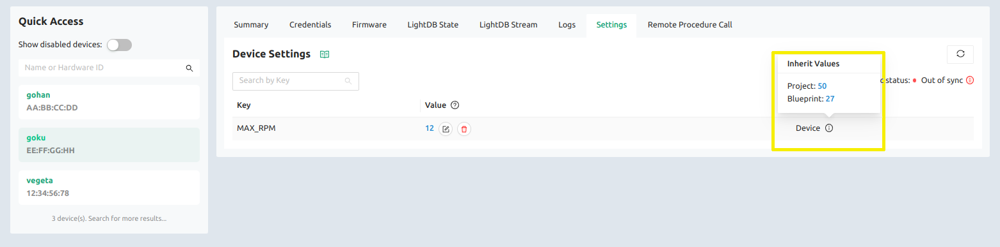

To work with settings the first thing to be done is to create a new setting and, for that, it's necessary to create a new one at project-level first. Rememeber, a project-level setting will be applied to all project devices.

### Creating a project-level setting

So, go to the `Device Settings` at the main page, and click on the `Create a device setting` button. The following window will be opened:

Type de setting key (or the setting name), chose the setting data type and set the value according to the selected data type. Let's create a setting which key is `MAX_RPM`, data type is `integer` and the value is `50`. Click on `save` to create it.

To change the current value or to override the setting value, click at the button highlighted by blue.

Now, all your connected devices will be notified about the new project-level setting. Those disconnected devices will receive the new setting as soon as they get connected again. It's automatic.

### Overriding a setting at the blueprint-level

It's not possible to create settings at other levels, expect at the project-level. But it's possible to override a project-level setting value to be applied only for the devices belonging to a specific blueprint. We call it blueprint-level override.

If you desire to set a different value only for all devices that belong to a specific blueprint, go to the blueprint details at the `Device Settings` section. 

Taking the above example, let's see how to override its value. But before, paya ttention at the `Level` column. For now, the setting has the level set as `project`, because it was created at the project level and there isn't override yet.

Notice the highlighted by blue button. Click on that and change the setting value. Click on save.

Now you can see the new value `27` and the level column is set to `blueprint`.

If you want remove this override, it's just to click at the `trash button`, highlighted by red.

Despite the fact we overrided the setting at the blueprint-level, the project-level continue existing with its original value and being applicable to all other devices that don't belongs to this blueprint.

### Overriding a setting at the device-level

As we can override project-level setting value at the blueprint-level, we also can override it at the device-level. This override will notify only this device, it's the most granular possibility of setting values.

To override it at the device-level, it's just to repete the process but instead of going to the blueprint details, go to the device details and thent o the settings tab.

There you can override the setting value only for that device. Let's check it:

To remove the device-level override, just click on the `trash button`.

If you stop the mouse over the icon next to the device level column value, a modal containing all the hierarchy of overrides will be shown:

