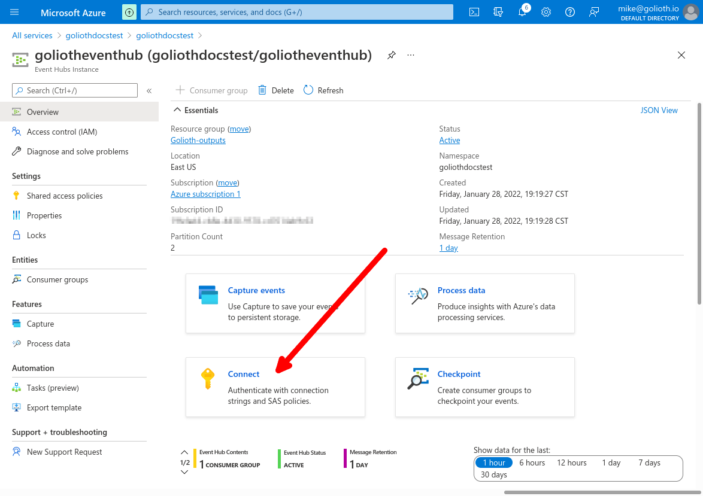
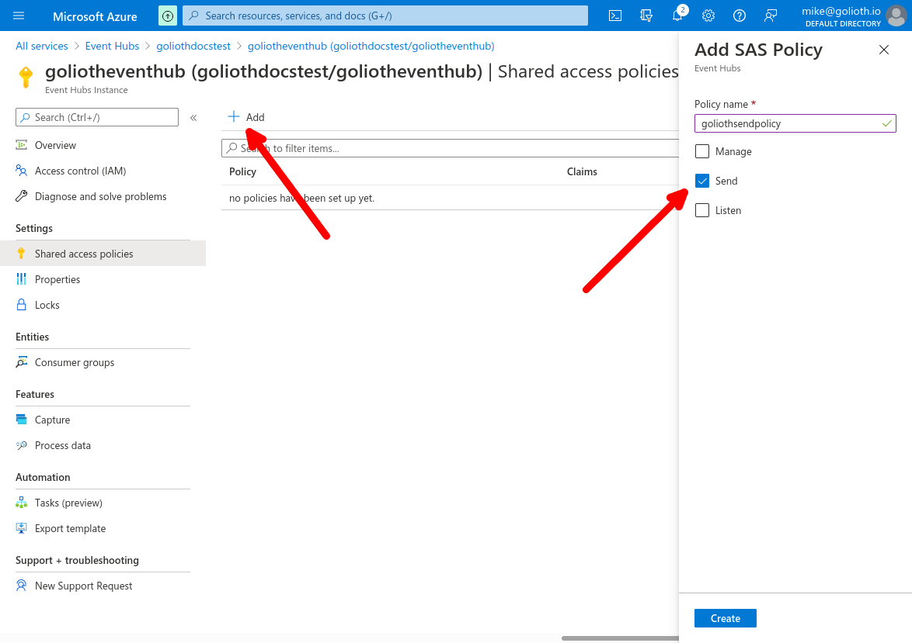
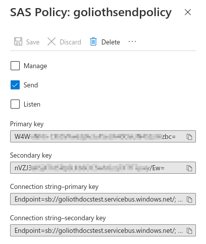

## Azure Event Hub

Azure Event Hub is a fully managed, real-time data ingestion service that can be used to consume Golioth events in a simple, trusted, and scalable way. You can ingest data in multiple ways inside Azure with support for popular protocols, including AMQP, HTTPS, and Apache Kafka. You can also consume Azure Event Hub in a serverless manner using Azure Functions.

### Azure Event Hub Specific Attributes

For each Output Stream type, there is a set of specify attributes. Here are the ones for Azure Event Hub:

| Attribute        | Type   | Required | Description                                                                                                                                                                                    |
| ---------------- | ------ | -------- | ---------------------------------------------------------------------------------------------------------------------------------------------------------------------------------------------- |
| connectionString | string | ✅       | Full connection string to reach Azure Event Hub topic: <br/><code>Endpoint=sb://{eventBus}.servicebus.windows.net/;SharedAccessKeyName={accessKeyName};SharedAccessKey={accessKey}</code> |
| topic            | string | ✅       | Azure Event Hub topic name                                                                                                                                                                     |

### Setup

To use this integration, you need to create an Event Hub on Azure and get the connection string and topic.

1. **Create and Event Hub:** Follow [Microsoft's Azure Quickstart](https://docs.microsoft.com/en-us/azure/event-hubs/event-hubs-create) to get started and create an event hub. Golioth uses the event hub topic name to connect

  

2. **Create a send policy:** Click the **+ Add** button. Enter a policy name, select Send, and click Create

    

3. **Get the connection string:** Click on the send policy you created. Copy the "Connection string–primary key" to use on Golioth

  

### Example

As mentioned on [Output Streams Overview](/cloud/output-streams), events are sent using [Cloud Events](https://cloudevents.io) format. For Azure Event Hub, some metadata of the event are sent together with the message body.

Here is an example of an event arriving on Event Hub. The payload will be inside a `data` attribute (see event payloads on [Output Streams Event Types](/cloud/output-streams/event-types/events)). The other attributes are metadata related to Cloud Events.

```json
{
  "specversion": "1.0",
  "id": "aa12dc4c-c5ed-4b46-92e5-5a726f4daa81",
  "source": "golioth/app/gateway/coap",
  "type": "DEVICE_STREAM_TYPE",
  "subject": "stream",
  "datacontenttype": "application/json",
  "time": "2022-01-27T16:17:06.458868Z",
  "data": {
    "data": { "temp": 32 },
    "device_id": "612d3cecf3ee17d321adbec6",
    "project_id": "my-first-project",
    "timestamp": { "nanos": 174295000, "seconds": 1643300226 }
  }
}
```
