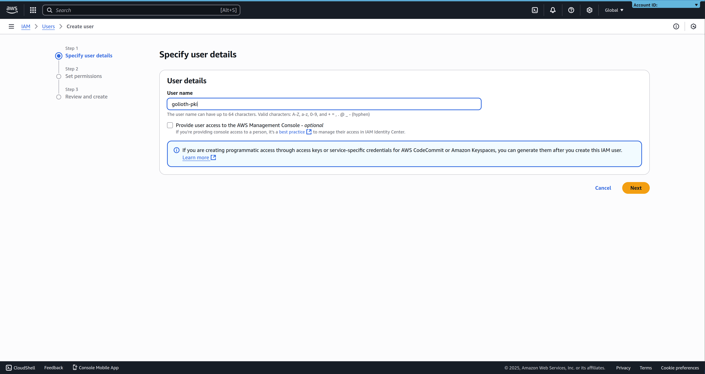
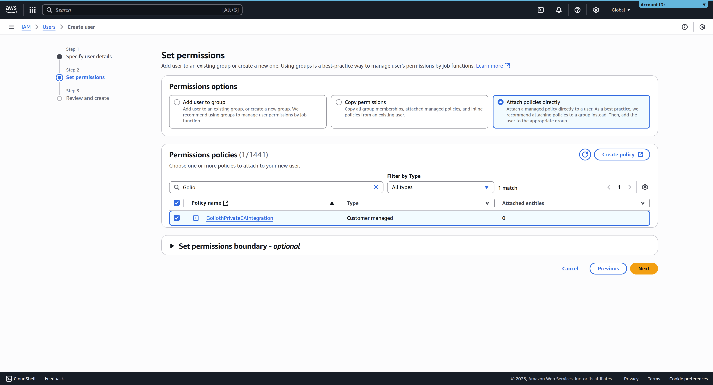
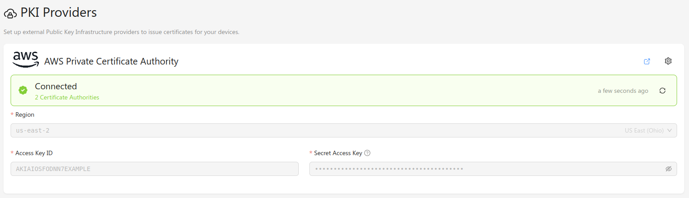

To allow Golioth to use your AWS Private Certificate Authority service as a PKI
provider for your project, you need to go through a few steps in the AWS Console
before you can configure a connection from Golioth.

For information about how you can establish a CA in AWS Private CA and issue
end-entity certificates, please refer to [the official AWS
documentation](https://docs.aws.amazon.com/privateca/latest/userguide/PcaWelcome.html).

## Configuring AWS

To allow Golioth to securely connect directly to your AWS Private CA service,
you'll need to create an IAM policy with the required permissions, then assign
that to a user.

### 1. Create a policy

Golioth requires a few permissions in the AWS Private CA service to be able to
authenticate devices and rotate certificates.

As none of the default policies fit the permissions requirements exactly, we'll
start by creating a new policy specifically for the integration with Golioth.

As an admin or an IAM user with the required permissions, navigate to the [IAM
Policy section](https://console.aws.amazon.com/iamv2/home#/policies), and click
**Create Policy**. Using the JSON Policy editor, add the following policy:

```json
{
    "Version": "2012-10-17",
    "Statement": [
        {
            "Effect": "Allow",
            "Action": [
                "acm-pca:ListCertificateAuthorities",
                "acm-pca:GetCertificateAuthorityCertificate",
                "acm-pca:GetCertificate"
            ],
            "Resource": "*"
        },
        {
            "Effect": "Allow",
            "Action": [
                "acm-pca:IssueCertificate"
            ],
            "Resource": "arn:aws:acm-pca:*:*:certificate-authority/*",
            "Condition": {
                "ArnLike": {
                    "acm-pca:TemplateArn": [
                        "arn:aws:acm-pca:*:*:template/EndEntityClientAuthCertificate_APIPassthrough/V*"
                    ]
                }
            }
        }
    ]
}
```

The first statement in this policy enables Golioth to iterate through your
certificate authorities, and retrieve their certificates. The second statement
allows Golioth to issue device certificates using the
[`EndEntityClientAuthCertificate_APIPassthrough/V1`
template](https://docs.aws.amazon.com/privateca/latest/userguide/template-definitions.html#EndEntityClientAuthCertificate_APIPassthrough).

:::tip
If you do not need certificate rotation capabilities, the
**AWSPrivateCAReadOnly** standard policy can be used instead.
:::

Save this policy with a recognizable name and description.

### 2. Create an IAM user

Golioth connects to your AWS Private CA service as an IAM user. Although it's
possible for Golioth to authenticate as an existing user, we strongly recommend
establishing a dedicated user to maintain a narrow set of permissions.

As an admin or an IAM user with the required permissions, navigate to the [IAM
User Management Dashboard](https://console.aws.amazon.com/iamv2/home#/users) in
the AWS Console, and click **Create User**.



Pick a recognizable user name, and click **Next** to go to the permissions
screen.

### 3. Attach the policy to the user

In the "Set Permissions" screen, select **Attach policies directly**, and search
for the policy created in [step 1](#1-create-a-policy). Select the policy, and
click **Next** to go the final user creation page.



Policies can either be attached to the user directly when you create it, or by
assigning the user to a user group with the required permissions.

### 4. Create an access key

Once the user is created with the required permissions, you'll need to create an
access key that Golioth can use to authenticate as that user.

Follow [the AWS
documentation](https://docs.aws.amazon.com/IAM/latest/UserGuide/access-keys-admin-managed.html)
for instructions on how to create an access key for an IAM user. Note that the
secret access key is only available during the creation process, and must be
saved before leaving the page.

## Connecting to AWS from the Golioth Console

Once you have an AWS IAM user with the required permissions, you can configure
Golioth's connection to the AWS Private CA from the Golioth Console. Navigate to
the PKI Providers section in the sidebar, and click **Add Provider**. In the
modal window, select _AWS Private Certificate Authority_, and the correct region
for your AWS instance. Add the Access Key ID and Secret Access Key that you
created in the AWS Console, and click **Connect**. The provider will be added to
the list of known providers, and a provider status check will run.

If everything is configured correctly, the provider status should change to
"Connected", and list the number of available certificate authorities.



## Issuing Device Certificates

Device certificates are [End Entity
Certificates](https://docs.aws.amazon.com/privateca/latest/userguide/PcaIssueCert.html)
in AWS.

As outlined in the [Certificate ID section](./README.md#certificate-ids),
the device certificate subject needs to include the following attributes:

- `Organization`: the device's project ID
- `CommonName`: a unique device certificate ID

Other subject attributes are ignored.

When performing certificate rotation, Golioth will submit certificate signing
requests to the AWS Private CA with the
[`EndEntityClientAuthCertificate_APIPassthrough/V1`
template](https://docs.aws.amazon.com/privateca/latest/userguide/template-definitions.html#EndEntityClientAuthCertificate_APIPassthrough).
The request will be submitted with an API passthrough value containing the
subject attributes above.
