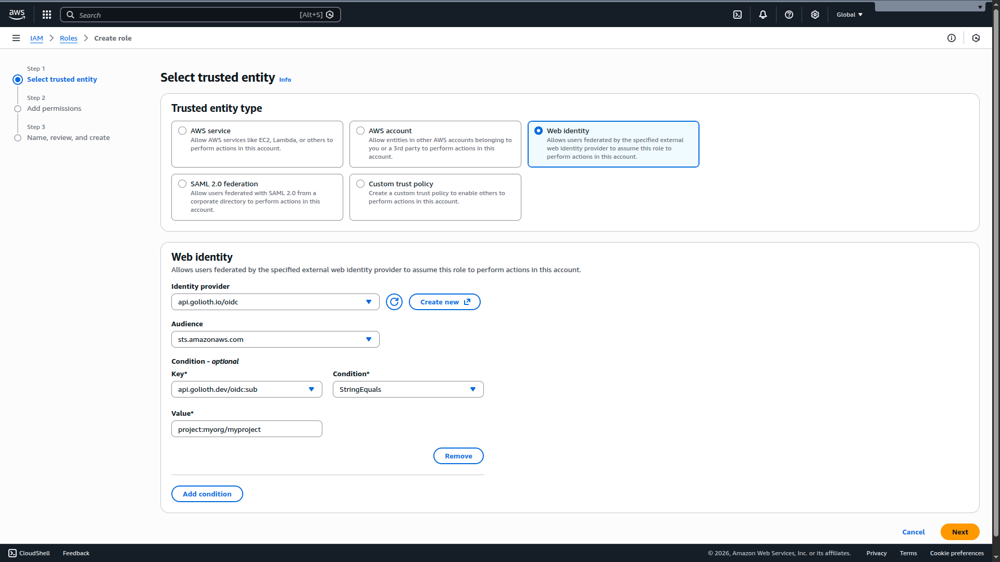
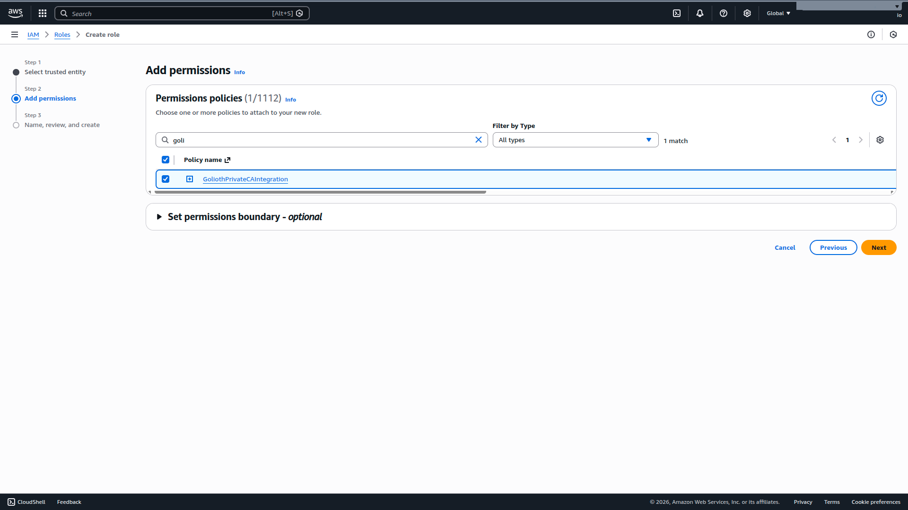
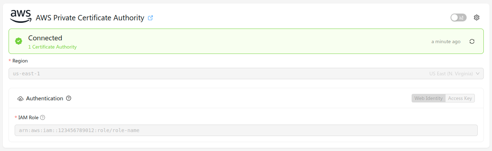
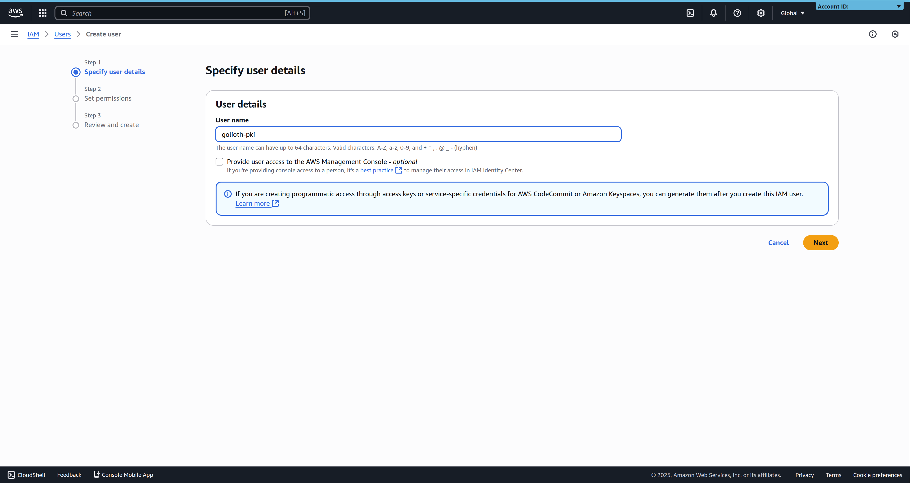
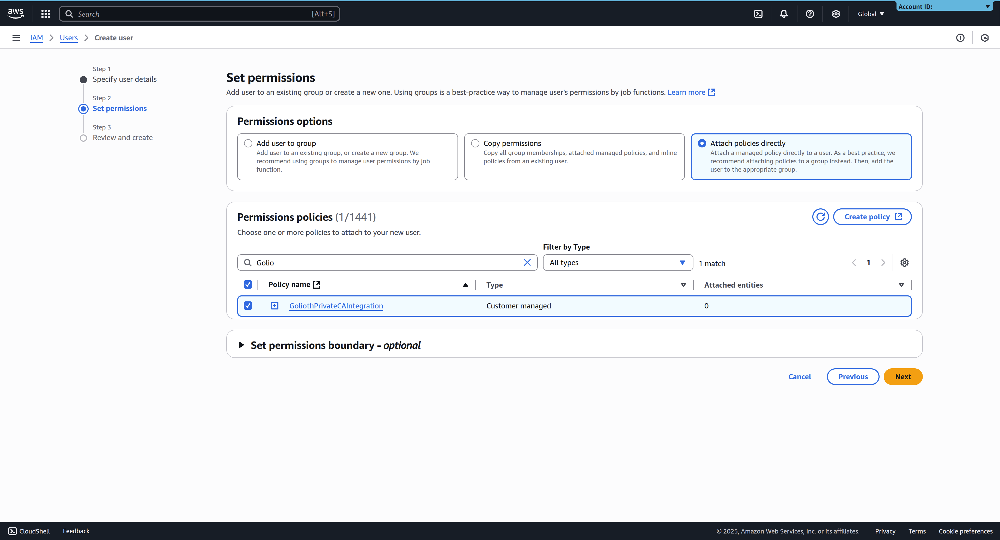
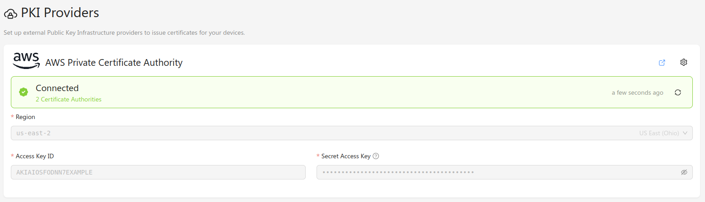

import Tabs from '@theme/Tabs';
import TabItem from '@theme/TabItem';

To allow Golioth to use your AWS Private Certificate Authority service as a PKI
provider for your project, you need to go through a few steps in the AWS Console
before you can configure a connection from Golioth.

For information about how you can establish a CA in AWS Private CA and issue
end-entity certificates, please refer to [the official AWS
documentation](https://docs.aws.amazon.com/privateca/latest/userguide/PcaWelcome.html).

## Configuring AWS

Golioth supports two authentication methods for connecting to AWS Private CA: [Web
Identity](https://docs.aws.amazon.com/IAM/latest/UserGuide/id_roles_providers_oidc.html)
and [Access Keys](https://docs.aws.amazon.com/IAM/latest/UserGuide/id_users_create.html). We strongly recommend using Web Identity, as this will allow Golioth to authenticate against your Private CA without storing long term credentials.

Select your preferred authentication method below to read more about how to set up your AWS instance to allow Golioth to authenticate against it.

<Tabs
groupId="aws-auth"
defaultValue="webidentity"
values={[
{label: 'Web Identity', value: 'webidentity'},
{label: 'Access key', value: 'accesskey'},
]}>
<TabItem value="webidentity">

To allow Golioth to securely connect directly to your AWS Private CA service with
an identity provider, you'll need to create an IAM policy with the required
permissions, then assign that to a role. The role will be verified by the Golioth OpenID Connect (OIDC) Identity Provider.

### 1. Create a policy

Golioth requires a few permissions in the AWS Private CA service to be able to
authenticate devices and rotate certificates.

As none of the default policies fit the permissions requirements exactly, we'll
start by creating a new policy specifically for the integration with Golioth.

As an admin or an IAM user with the required permissions, navigate to the [IAM
Policy section](https://console.aws.amazon.com/iamv2/home#/policies), and click
**Create Policy**. Using the JSON Policy editor, add the following policy:

```json
{
  "Version": "2012-10-17",
  "Statement": [
    {
      "Effect": "Allow",
      "Action": [
        "acm-pca:ListCertificateAuthorities",
        "acm-pca:GetCertificateAuthorityCertificate",
        "acm-pca:GetCertificate"
      ],
      "Resource": "*"
    },
    {
      "Effect": "Allow",
      "Action": ["acm-pca:IssueCertificate"],
      "Resource": "arn:aws:acm-pca:*:*:certificate-authority/*",
      "Condition": {
        "ArnLike": {
          "acm-pca:TemplateArn": [
            "arn:aws:acm-pca:*:*:template/EndEntityClientAuthCertificate_APIPassthrough/V*"
          ]
        }
      }
    }
  ]
}
```

### 2. Register ID Provider

Once we have created a policy, we'll need to register the Golioth identity provider as a trusted Identity Provider. In the [IAM
Identity Providers section](https://console.aws.amazon.com/iamv2/home#/identity_providers), click **Add Provider**.

Under Provider type, select _OpenID Connect_, then set the Provider URL to `https://api.golioth.io/oidc`, and the Audience to `sts.amazonaws.com`.

Click **Add Provider** to save the new provider.

### 3. Create a role

Next, we need to create a role that Golioth can assume when it connects to AWS.
In the [IAM Roles section](https://console.aws.amazon.com/iamv2/home#/roles),
click **Create Role**.

Under Trusted entity type, select _Web identity_, and select the Identity provider and audience you created in the previous step.

Add a condition by clicking **Add Condition**. Under **Key**, select `api.golioth.dev/oidc:sub`. Set **Condition** to `StringEquals`, and **Value** to match the following format:

```
project:<golioth-org>/<golioth-project>
```

Here, `<golioth-org>/<golioth-project>` is the organization and project slugs for your project, as seen in the Golioth Console. For instance, if the Golioth Console URI for your project is `https://console.golioth.io/org/myorg/project/myproject`, Golioth will use `project:myorg/myproject` as its token subject when connecting to AWS.

:::warning
The condition is the mechanism that allows AWS to control which Golioth
projects are allowed to connect to the Private CA. It is crucial that the
condition is included in the role definition, as failing to add this will allow
any Golioth project in any organization to connect to the Private CA.
:::



Click Next to move to the "Add Permissions" screen.

### 4. Attach the policy to the role

In the "Add Permissions" screen, search for the policy created in [step
1](#1-create-a-policy). Select the policy, and click **Next** to go the final
role creation page.



Finally, give the new role a name and an optional description and click **Create
Role**.

## Connecting to AWS from the Golioth Console

Once you have an AWS IAM role with the required permissions, you can configure
Golioth's connection to the AWS Private CA from the Golioth Console. Navigate to
the PKI Providers section in the sidebar, and click **Add Provider**. In the
modal window, select _AWS Private Certificate Authority_, and the correct region
for your AWS instance. Under _Authentication_, select _Web Identity_, and add the
ARN of the role you created in the AWS Console, then click **Connect**. The
provider will be added to the list of known providers, and a provider status
check will run.

AWS usually takes a couple of minutes to deploy your policy, and the status check
may report `AccessDenied: Not authorized to perform sts:AssumeRoleWithWebIdentity
status code: 403` or a similar error while your changes are being processed.

Once everything is configured correctly and your policy is deployed, the provider
status should change to "Connected", and list the number of available certificate
authorities.



</TabItem>
<TabItem value="accesskey">

To allow Golioth to securely connect directly to your AWS Private CA service with
an access key, you'll need to create an IAM policy with the required permissions,
then assign that to a user.

### 1. Create a policy

Golioth requires a few permissions in the AWS Private CA service to be able to
authenticate devices and rotate certificates.

As none of the default policies fit the permissions requirements exactly, we'll
start by creating a new policy specifically for the integration with Golioth.

As an admin or an IAM user with the required permissions, navigate to the [IAM
Policy section](https://console.aws.amazon.com/iamv2/home#/policies), and click
**Create Policy**. Using the JSON Policy editor, add the following policy:

```json
{
  "Version": "2012-10-17",
  "Statement": [
    {
      "Effect": "Allow",
      "Action": [
        "acm-pca:ListCertificateAuthorities",
        "acm-pca:GetCertificateAuthorityCertificate",
        "acm-pca:GetCertificate"
      ],
      "Resource": "*"
    },
    {
      "Effect": "Allow",
      "Action": ["acm-pca:IssueCertificate"],
      "Resource": "arn:aws:acm-pca:*:*:certificate-authority/*",
      "Condition": {
        "ArnLike": {
          "acm-pca:TemplateArn": [
            "arn:aws:acm-pca:*:*:template/EndEntityClientAuthCertificate_APIPassthrough/V*"
          ]
        }
      }
    }
  ]
}
```

The first statement in this policy enables Golioth to iterate through your
certificate authorities, and retrieve their certificates. The second statement
allows Golioth to issue device certificates using the
[`EndEntityClientAuthCertificate_APIPassthrough/V1`
template](https://docs.aws.amazon.com/privateca/latest/userguide/template-definitions.html#EndEntityClientAuthCertificate_APIPassthrough).

:::tip
If you do not need certificate rotation capabilities, the
**AWSPrivateCAReadOnly** standard policy can be used instead.
:::

Save this policy with a recognizable name and description.

### 2. Create an IAM user

Golioth connects to your AWS Private CA service as an IAM user. Although it's
possible for Golioth to authenticate as an existing user, we strongly recommend
establishing a dedicated user to maintain a narrow set of permissions.

As an admin or an IAM user with the required permissions, navigate to the [IAM
User Management Dashboard](https://console.aws.amazon.com/iamv2/home#/users) in
the AWS Console, and click **Create User**.



Pick a recognizable user name, and click **Next** to go to the permissions
screen.

### 3. Attach the policy to the user

In the "Set Permissions" screen, select **Attach policies directly**, and search
for the policy created in [step 1](#1-create-a-policy). Select the policy, and
click **Next** to go the final user creation page.



Policies can either be attached to the user directly when you create it, or by
assigning the user to a user group with the required permissions.

### 4. Create an access key

Once the user is created with the required permissions, you'll need to create an
access key that Golioth can use to authenticate as that user.

Follow [the AWS
documentation](https://docs.aws.amazon.com/IAM/latest/UserGuide/access-keys-admin-managed.html)
for instructions on how to create an access key for an IAM user. Note that the
secret access key is only available during the creation process, and must be
saved before leaving the page.

## Connecting to AWS from the Golioth Console

Once you have an AWS IAM user with the required permissions, you can configure
Golioth's connection to the AWS Private CA from the Golioth Console. Navigate to
the PKI Providers section in the sidebar, and click **Add Provider**. In the
modal window, select _AWS Private Certificate Authority_, and the correct region
for your AWS instance. Add the Access Key ID and Secret Access Key that you
created in the AWS Console, and click **Connect**. The provider will be added to
the list of known providers, and a provider status check will run.

If everything is configured correctly, the provider status should change to
"Connected", and list the number of available certificate authorities.



</TabItem>
</Tabs>

## Issuing Device Certificates

Device certificates are [End Entity
Certificates](https://docs.aws.amazon.com/privateca/latest/userguide/PcaIssueCert.html)
in AWS.

As outlined in the [Certificate ID section](./README.md#certificate-ids),
the device certificate subject needs to include the following attributes:

- `Organization`: the device's project ID
- `CommonName`: a unique device certificate ID

Other subject attributes are ignored.

When performing certificate rotation, Golioth will submit certificate signing
requests to the AWS Private CA with the
[`EndEntityClientAuthCertificate_APIPassthrough/V1`
template](https://docs.aws.amazon.com/privateca/latest/userguide/template-definitions.html#EndEntityClientAuthCertificate_APIPassthrough).
The request will be submitted with an API passthrough value containing the
subject attributes above.
