[MongoDB](https://www.mongodb.com/) is a document database and has
support for timeseries collections, which can be used to consume Golioth
events in a simple, trusted, and scalable way. Golioth's Output Stream for
MongoDB Cloud allows you to transform Golioth events into MongoDB's native
BSON document and ingest them in your MongoDB instance.

## MongoDB Specific Attributes

For each Output Stream type, there is a set of specified attributes. Here are
the ones for MongoDB:

| Attribute          | Type   | Required | Description |
| ------------------ | ------ |:--------:| ----------- |
| Name               | string | ✅       | Name to identify the Output Stream |
| Connection String  | string | ✅       | Connection string containing username and password |
| Database           | string | ✅       | Name of the MongoDB database |
| Collection         | string | ✅       | Name of the MongoDB collection |
| Timefield          | string | ✅       | Name to use for the timefield in the BSON document (e.g. "timestamp")|
| Metafield          | string | ✅       | Name to use for the metafield in the BSON document (e.g. "metadata")|

## Overview

To use this integration, you need to:

- Have a MongoDB instance (either a standalone instance or in Atlas, Mongo's
  managed service)
- Create a MongoDB user that has a username and password
- Create a timeseries collection in your MongoDB database
- (Optional) Add Golioth's IP address to your Atlas IP Access List
- Create an instance of the MongoDB Output Stream in your Golioth account

## Setup the MongoDB Output Stream

### 1. Setup a MongoDB deployment

If you're using MongoDB Atlas, see the [Getting Started with
Atlas](https://www.mongodb.com/docs/atlas/getting-started/) tutorial.

If you're using a local MongoDB installation, see the [Install
MongoDB](https://www.mongodb.com/docs/manual/installation/#std-label-tutorial-installation)
tutorial.

### 2. Create a MongoDB database user

If you are using MongoDB Atlas, see [Create a Database User for Your
Cluster](https://www.mongodb.com/docs/atlas/tutorial/create-mongodb-user-for-cluster/).

### 3. Create a timeseries collection

To use the MongoDB timeseries outputstream you must create a timeseries
collection in your MongoDB database.

#### Creating the timeseries collection from mongosh

You can connect to your MongoDB database using the monogsh command, and then
from there you can create your timeseries collection. For example:

```
db.createCollection(
"weather",
{
  timeseries: {
  timeField: "timestamp",
  metaField: "metadata"
}})
```

#### Creating the timeseries collection from Atlas

You can create your timeseries collection from the Atlas console.

From the collections pages, click the `plus` sign next to the database name.

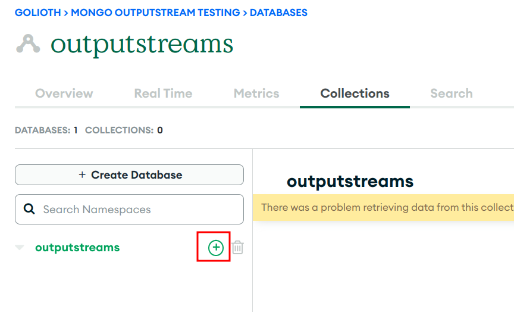

Next, you will see the `Create Collection` form.

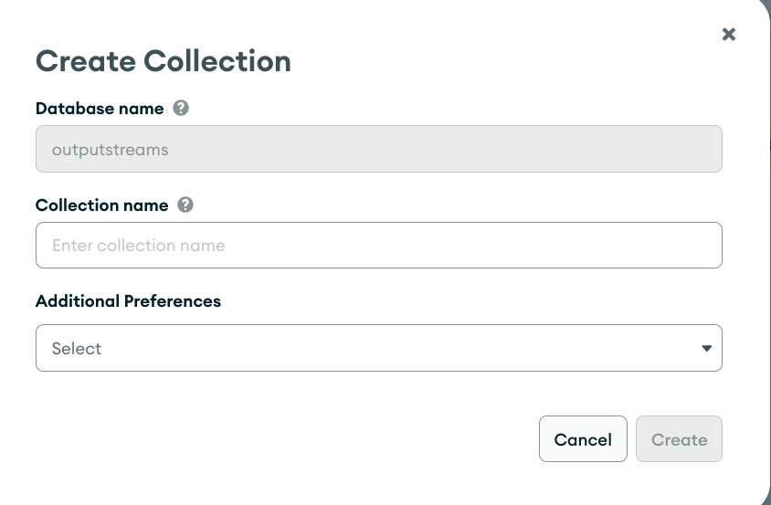

In the `Collection name` field, give your collection a name (e.g. `events`).
Then, in the `Additional Preferences` dropdown, select `Time Series Collection`.

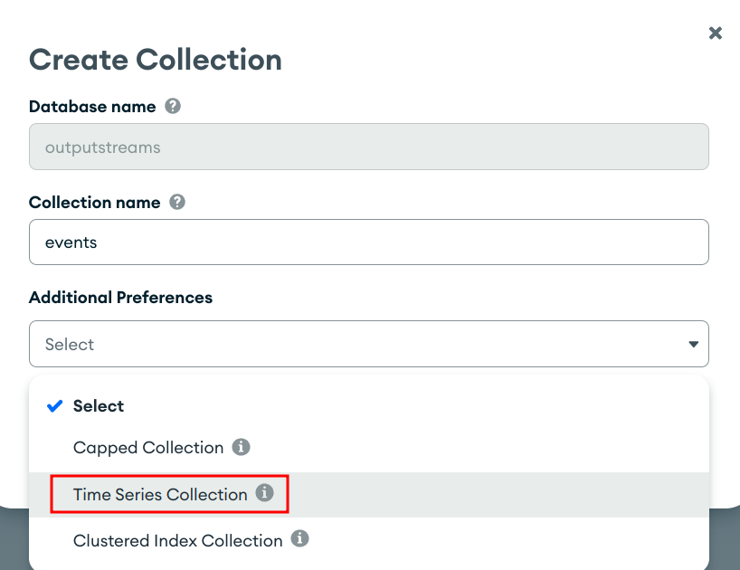

Provide names for the `timeField` and `metaField` form fields. You will use
these fields when you create the outputstream in the Golioth console.

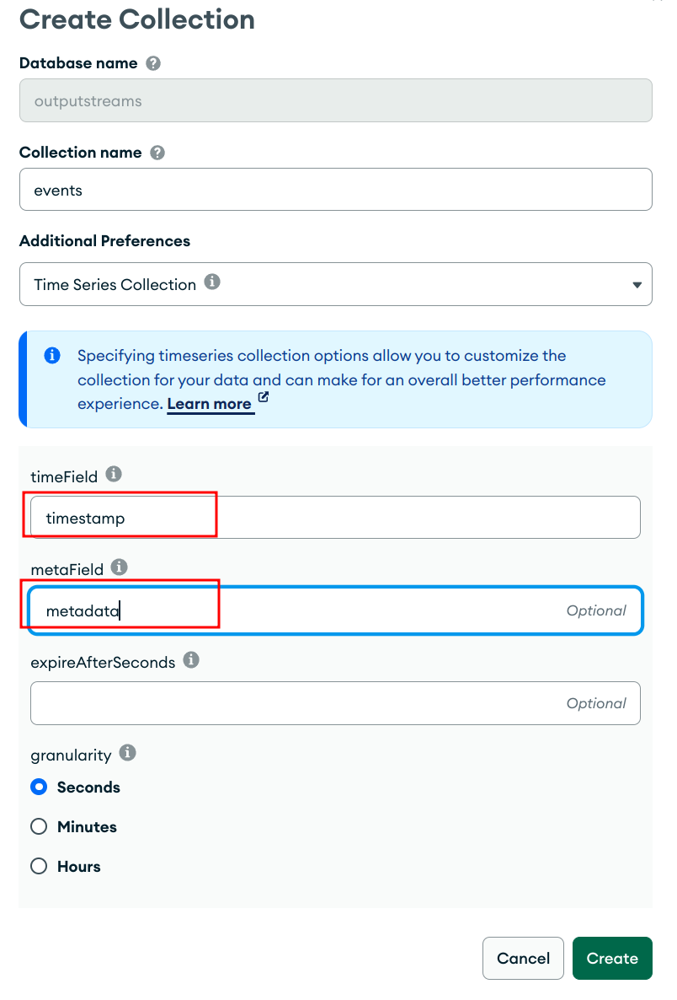

Finally, click the `Create` button.

### 4. Get the MongoDB connection string

#### Local deployment

If you're using a local deployment, the connection string will be of the form
`mongodb://<username>:<password>@localhost:[port]` where the port is 27017 by
default.

#### Atlas deployment

If you're using an Atlas deployment, you can get the connection string from the
Atlas console. From the `Database Deployments` screen, click the `Connect`
button.

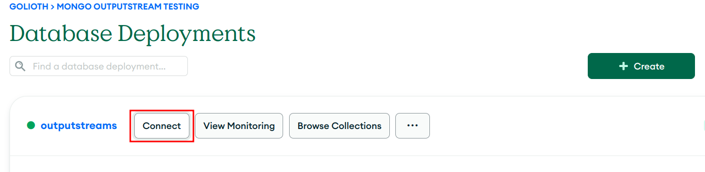

Next, under `Access your data through tools`, select `Compass`.

Finally, copy the connection string without a trailing slash.

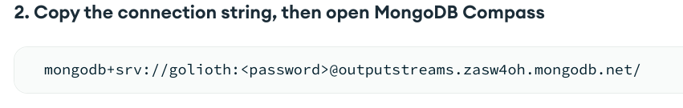

### 5. Add Golioth IP Address to Access List (MongoDB Atlas)
In order for Golioth to send your events to your MongoDB timeseries collection,
you will need to add Golioth's IP address to your MongoDB Atlas IP Access List.

From the left-hand navigation in the Atlas console, click the `Network Access`
link.

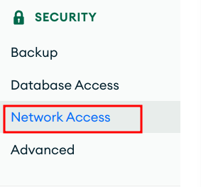

From the `Network Access` screen, click the `ADD IP ADDRESS` button.

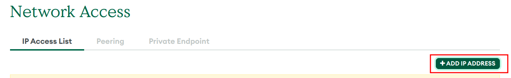

Add `34.136.157.127/32` to the `Access List Entry` field, and optionally add a
comment, e.g. "Golioth". Then click `Confirm`.

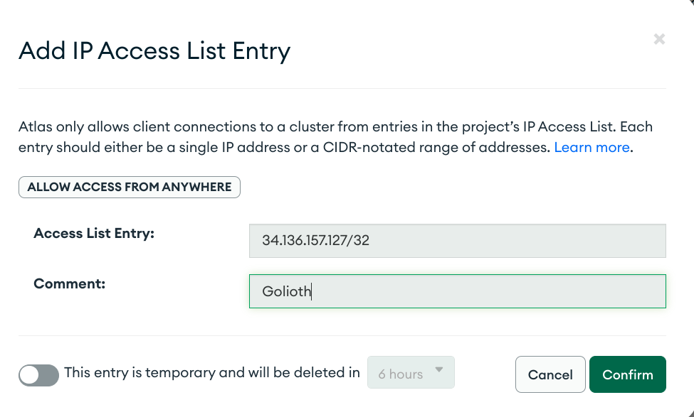

### 6. Create an MongoDB Output Stream in the Golioth console

From the `Select an Output Stream Type` page, select `MongoDB`.

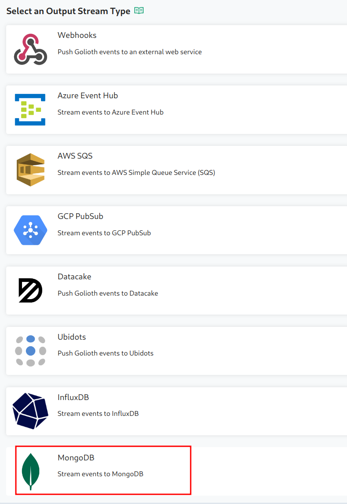

In the `Create a new Output Stream` form, enter the following:

* **Name**: The name you want to give to your Output Stream
* **Event Type Filter**: select `DEVICE_STREAM_TYPE` from the list of types (the
  MongoDB Output Stream is currently limited to stream events only)
* **Connection String**: Paste the `Connection String` you copied for your
  MongoDB cluster
* **Database**: the name of an existing MongoDB database where you want to send
  your events
* **Collection**: The time series collection to store your events
* **Timefield**: the name of the field containing the date in your time series
  document
* **Metafield**: the name of the field containing metadata in your timeseries
  document (your deviceId and projectId will be populated here)

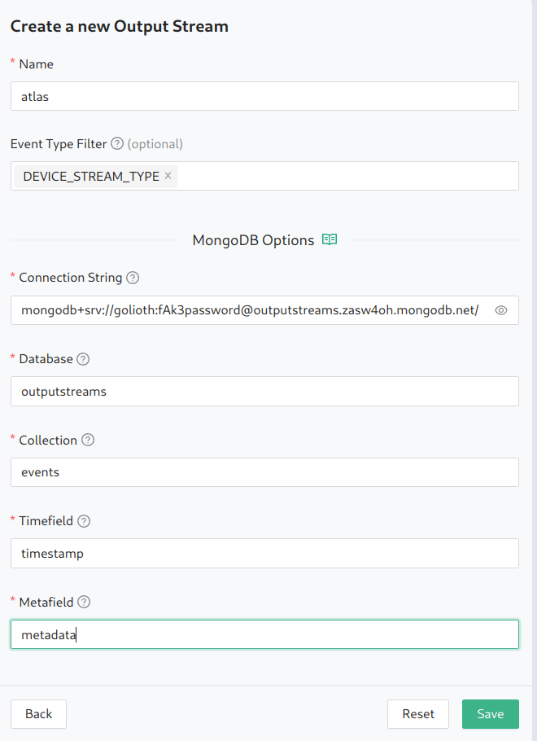

## Example Data

Golioth Output Streams utilize the [Cloud Events](https://cloudevents.io/)
format. Therefore, it is necessary to transform events from the CloudEvents
format into a MongoDB BSON (Binary JSON) document.

Here is an example of a CloudEvent on the Golioth platform:

```json
Context Attributes,
  specversion: 1.0
  type: TEST_EVENT_TYPE
  source: golioth/app/api
  subject: integration
  id: 18914e4f-3620-48e2-9772-03fe12e757da
  datacontenttype: application/json
Data,
  {
    "timestamp": {
      "seconds": 1682614592,
      "nanos": 987338334
    },
    "project_id": "64230895aff1018f3aacabab",
    "integration_id": "644aa93df9021bf366e0a255",
    "data": {
      "hello": "world"
    }
  }
```

We transform the above CloudEvent to the following BSON document:

```json
{
    timestamp: 2023-08-15T21:27:06.219+00:00,
    metadata: {
        device_id: "62def0a5316b32515f36fe2e",
        project_id: "64230895aff1018f3aacabab",
    },
    _id: ObjectId('64dbedaa2ee9615b83f21576'),
    data: {
        "hello": "world"
    }
}
```
