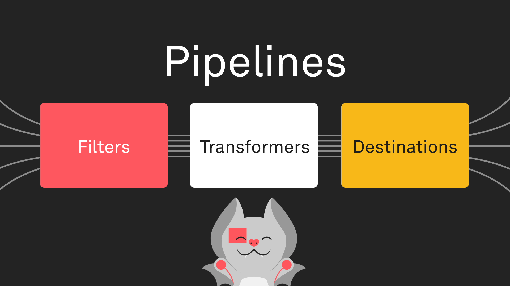

Data Routing allows ingestion, transformation, and delivery of streaming data
from devices to a wide array of destinations.

## Streaming Data

Data that is sent from devices to the Golioth platform with the intention of
eventually delivering to some storage or processing destination is referred to
as streaming data. Devices send streaming data to any endpoint prefixed by
`/.s/`. The portion of the endpoint path that follows the `/.s/` prefix is used
for routing the data to a given destination. This allows for devices to indicate
the type of streaming data being delivered, and for a Golioth project to process
different types of data using specific logic.

## Pipelines

:::tip
Anywhere you see a pipeline YAML document provided in the Golioth documentation,
you can click `Use this Pipeline` to open it in the pipeline editor in your
project in the Golioth console.
:::

Pipelines are the mechanism by which streaming data from devices in a given
project on Golioth is transformed and directed to a destination. Pipelines
support complex routing configurations, allowing for delivery of different data
types and formats to one or more locations.

Pipelines are configured in a project using a YAML document, which defines a
[filter](/data-routing/filters) and steps. Any data message may be matched to
zero or more pipelines based on its [path](/data-routing/filters/path) and
[content type](/data-routing/filters/content-type).

Each step includes a [transformer](/data-routing/transformers), a
[destination](/data-routing/destinations), or both. When both are supplied, the
transformed data is only passed to the destination in its step, and the data
prior to transformation is passed to subsequent steps if any exist. If a
transformer is supplied without a destination, the transformed data is passed to
all subsequent steps. Steps my be chained together in sequence to perform
multiple transformations of the data and deliver to multiple destinations. Each
step has a name, and steps are executed in the order they are specified in the
YAML document.

To get started with your first pipeline, select one from the prepared
[examples](/data-routing/examples).

### Message Structure

Data messages passing through pipelines consist of a payload and metadata. The
initial payload consists of the exact data that was sent by the device. Metadata
includes information about the message and the device that sent it, such as
Golioth project ID, device ID, and timestamp.

Transformations may modify the payload of the data message before it is
ultimately delivered to one or more destinations. A destination may require a
specific format for the payload in order to deliver it, or transform and deliver
it, to an external location.

### Format Versioning

The currently supported format version for Pipelines is `v1`. Format version may
be specified by a top-level `version` field in a pipeline's YAML configuration.
If no `version` is provided, `v1` is inferred.
