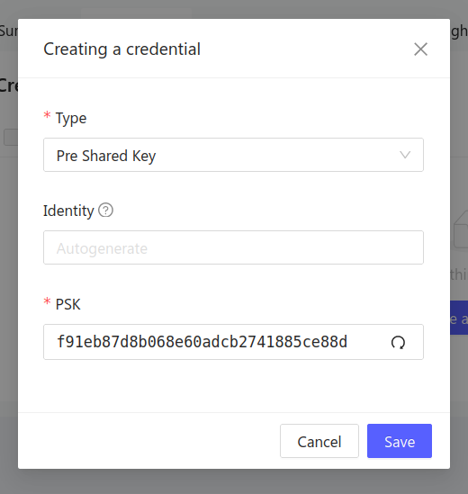
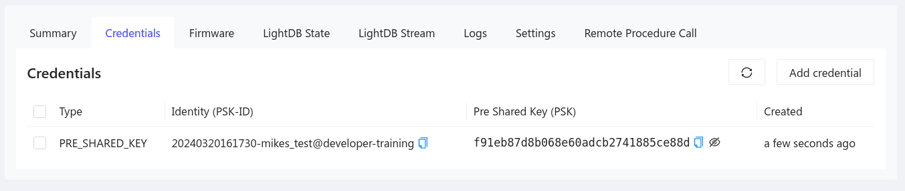

# Pre-Shared Key (PSK)

Pre-Shared Key (PSK) authentication relies on sharing both an identity and a key
between the device and the server before a connection can be made.

This is akin to a username/password and is generally considered less secure than
using certificate authentication. However, it does provide an encrypted
connection, and the relative simplicity makes this a viable approach for sample
code and demonstrations. In some cases, constrained devices may be unable to
support X.509 certificate authentication and PSK may be an option.

## Generating PSK Credentials

Use the Golioth web console to generate the PSK credential.

1. Navigate to your device in the [Golioth web
   console](https://console.golioth.io).
2. Click the name of your device to open the device summary page.
3. Click the `Credentials` tab along the top of the device summary page.
4. Click `Add credential` to create a new PSK credential.

- You may optionally customize the `Identity` of this device. If you leave the
  `Identity field` blank, a timestamp and the name of the device is used.
- A randomly generated `PSK` will be shown. You may choose to accept this,
  manually change the value, or click the circular arrow icon to regenerate it.

:::tip Creating new devices generates PSK credentials

When adding a new device to the Golioth web console, a PSK credential will be
automatically created (and may be customized at that time). This behavior is
expected as Golioth device connections are secure by default

:::

## Accessing existing PSK Credentials

Once created, you may return to access exiting PSK credentials at any time.

1. Navigate to your device in the [Golioth web
   console](https://console.golioth.io).
2. Click the name of your device to open the device summary page.
3. Click the `Credentials` tab along the top of the device summary page.

:::info PSK-ID includes the Project ID

By convention, the `project-name` will be added to the end of the Identity
(PSK-ID).

In the image above, you can see the automatically generated identity
begins with a timestamp and the device name (`20240320161730-mikes_test`),
followed by an at sign (`@`) and the project-id (`developer-training`)

:::
