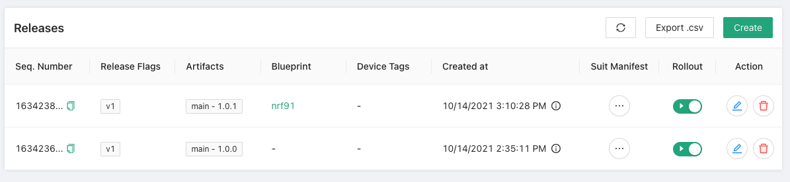
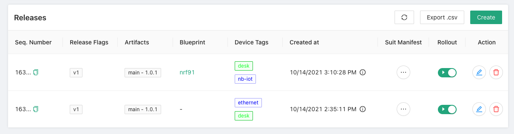

To make a firmware update available to your devices, you must first create a Release. A release is a set of artifact versions that are available. Here is an example of a command to create a release with the artifact that we created earlier:

```
# Filtering artifacts with nrf91 blueprint
$ goliothctl dfu release create --release-tags v1 --components main@1.0.1 --rollout true --blueprint nrf91
# Without blueprint
$ goliothctl dfu release create --release-tags v1 --components main@1.0.1 --rollout true
```

Now you can check on our Web Console for the created releases and see the releases `1.0.0` in the list.



You can also add device tags to target more specific devices.



Or you can also check with `goliothctl dfu release list`:

```
$ goliothctl dfu release list
id:"616880a46c69662e10832873" release_tags:"v1" rollout:true sequence_number:1634238628474218987 blueprint:"nrf91" device_tags:"desk" device_tags:"nb-iot" components:"main@1.0.1"
id:"6168785f6c69662e1083286b" release_tags:"v1" rollout:true sequence_number:1634236511222937406 device_tags:"ethernet" device_tags:"desk" components:"main@1.0.1"
```
