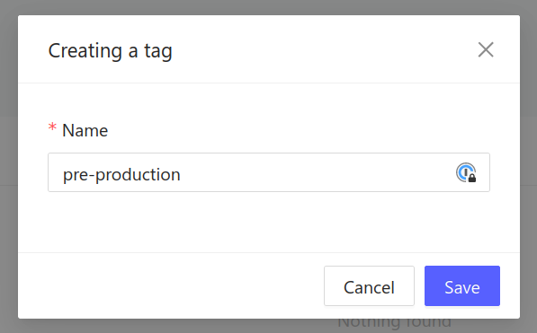
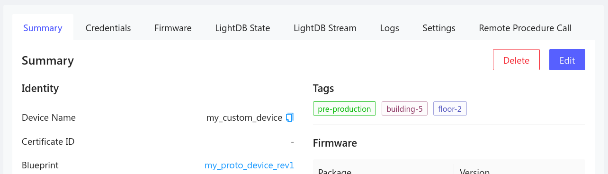

# Device Tags

Device tags are useful for segmenting your IoT fleet into groups of devices. As
an example, you might create a tag for each of the following groups:

- All devices in the same building
- All devices on the same floor of a building
- All devices that have a camera
- A subset of devices used in pre-production OTA testing

Tags may be used in filtering over the air (OTA) firmware updates and when
querying the Golioth REST API. Tags are optional, and multiple tags may be added
to each device.

## Create a new tag

1. Navigate to the [Golioth web console](https://console.golioth.io).
2. Select `Tags` from the left sidebar.
3. Click the `Create` button.

- Choose a unique name for your tag.

## Add or remove tags from a device

You may add tags to a device when it is created, or use the edit button
on the device summary to add or remove tags from an existing device.

Tags associated with a device will be shown on that device's summary page.

## Use tags to filter OTA firmware updates

Tags may be used to filter over the air (OTA) firmware updates. Choose zero or
more tags when you create a release.

:::tip Release tags apply to all devices that **exactly** match those tags

When you apply one or more tags to a firmware release, all devices must exactly
match that combination of tags to be notified of the firmware release. The
exception to this rule is that a release that has no tags will notify all
devices, no matter if the devices have tags applied or not. For example:

- Release that has no tags will be received by all devices, even those that have
  tags.
- Release that has the `pre-production` tag will only be received by devices
  that only have the `pre-production` tag (and no other tags) assigned.
- Release that has both `pre-production` and `building-5` tags will **NOT** be
  received by a devices that only has the `pre-production` tag.

:::
