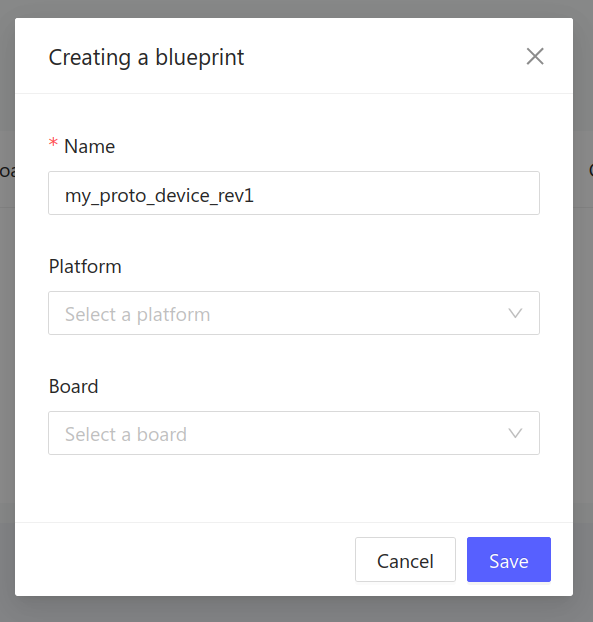
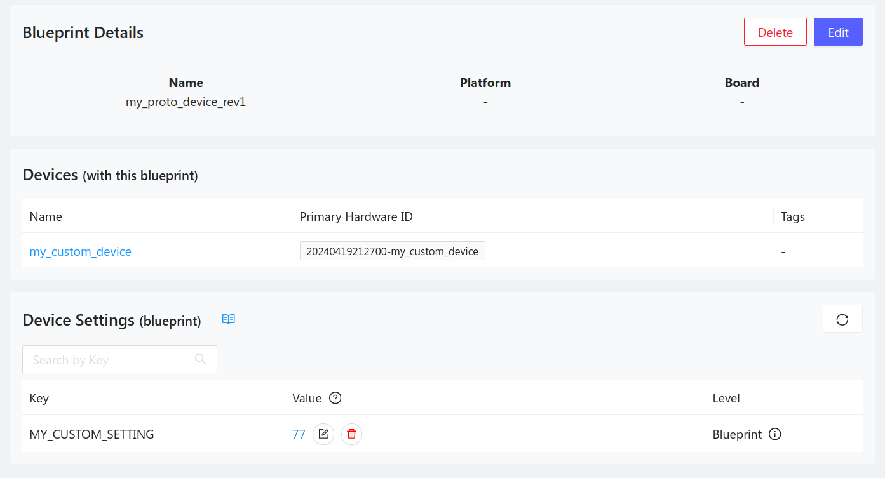

# Device Blueprints

Blueprints are a great way to segment your IoT fleet by hardware-type. You might
create a blueprint for each revision of a particular board, or use one blueprint
for each hardware variation that uses a different type of sensor. These
blueprints can be used to adjust settings for groups of devices with a single
action.

## Create a new blueprint

1. Navigate to the [Golioth web console](https://console.golioth.io).
2. Select `Blueprints` from the left sidebar.
3. Click the `Create` button.

- Choose a unique name for your blueprint.
- Optional: use standardized board details by selecting a `Platform` and `Board`
  from the dropdown menus.

## Add or remove a blueprint from a device

You may add a blueprint to a device when it is created, or use the edit button
on the device summary to add or remove a blueprint from an existing device.

## Use a blueprint to filter Device Settings

You can update settings for all devices that share the same blueprint by
adjusting the setting in the Blueprints summary page.

1. Navigate to the [Golioth web console](https://console.golioth.io).
2. Make sure at least one setting exists in the `Device Settings` menu of your
   project.
3. Select `Blueprints` from the left sidebar.
4. Click on the name of the blueprint you want to target.
5. Use the pencil and paper icon to edit the blueprint-level value of your
   desired setting.

- The `Level` column will indicate the setting currently being honored for these
  devices.
- When updating a setting, a confirmation window will indicate how many devices
  will be affected by the change.
