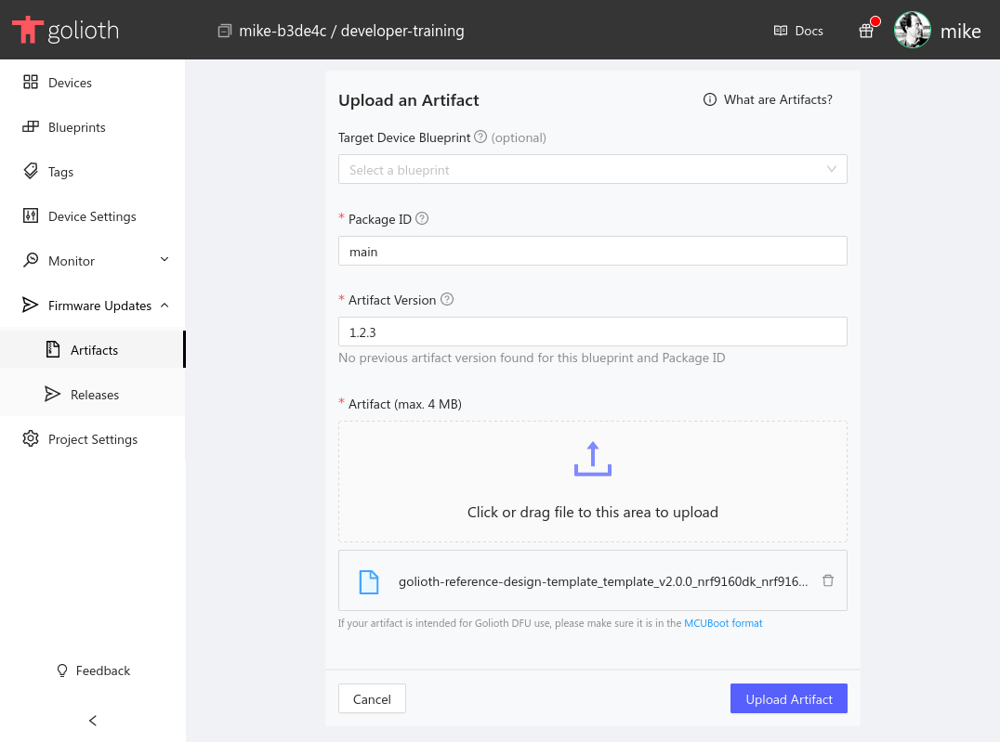

A package represents a single upgradeable component on your embedded device.
Each package has a list of versions, each with a version number and an artifact,
as well as a description and user defined metadata fields for categorizing the
package.

Generally, it's recommended to make one package for each unique component in
your project. For example, if two different devices in your project use the same
AI model, you only need to create a single package to represent it. You can
deploy the AI model package to both types of devices individually.

To upgrade a package on one of your devices, you'll first need to upload the new
version to Golioth as an artifact.

We provide a [firmware update sample
application](https://github.com/golioth/golioth-firmware-sdk/tree/main/examples/zephyr/fw_update)
that can be used to test our OTA service. The sample listens for new deployment
events from our backend and automatically downloads and installs them with
MCUboot.

Follow [the Firmware OTA Upgrade
guide](/firmware/golioth-firmware-sdk/firmware-upgrade/firmware-upgrade) to
build the sample application for your target board.

## Creating a new package in the Golioth Web Console

1. Navigate to [the Packages section](https://console.golioth.io/packages) of
   the Golioth Web Console
2. Click the `Create` button
3. Fill in the relevant information:
    - Give the package a name (Use `main` if you're working with the firmware
      update sample)
    - Optional: Give the package a short description
    - Optional: Set properties to help categorize your package (e.g. `type`:
      `firmware`)

    

## Uploading a new package version in the Golioth Web Console

1. Navigate to [the Packages section](https://console.golioth.io/packages) of
   the Golioth Web Console
2. Open your package in the list
3. Click the `New Version` button
4. Fill in the relevant information
    - Set the version number of your artifact (eg: `1.2.3` or `2024-Q4`)
    - Choose the binary you want to upload

    

5. Click the `Upload Artifact` button and the new version will appear in the
   version list:

    
