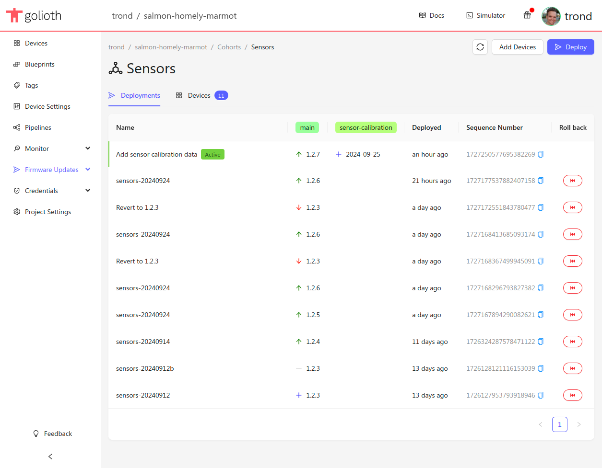
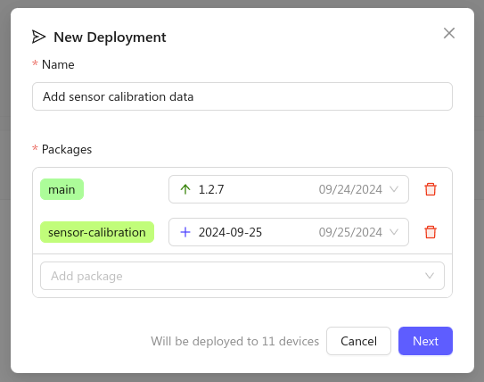
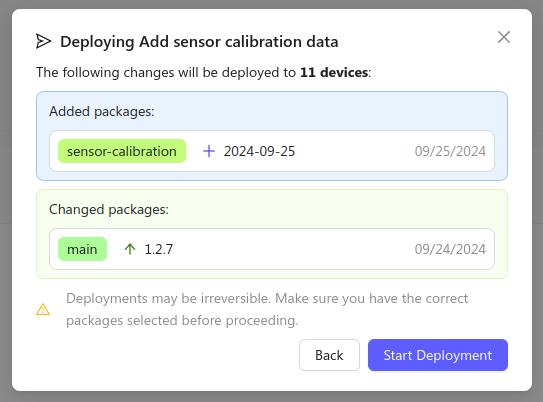

You can push OTA updates to all devices in a cohort by creating Deployments.
Each deployment contains a set of packages, which decide the composition of the
firmware and assets on all devices in the cohort. Each cohort can only have one
active deployment at a time, and deployments are always pushed to all devices in
the cohort with as soon as they connect to Golioth's servers.

:::info Deployments are immutable

Once a deployment has been pushed to your cohort, it cannot be reverted or
deleted. To roll back to a previous version of a package, you have to create a
new deployment.

:::

The deployment history for your Cohort is available in Cohort's page the Golioth
Web Console. Here, you can see the changes in packages and their versions from
deployment to deployment. New deployments are added to the top of the list, and
all packages that have been used in any of the last 10 deployments are displayed
in their own column.

You can add and remove packages from one deployment to the next. It's up to you
how you want your firmware to handle changes to the set of included packages.
While it may make sense to delete the on-device copy of an asset like an image
when it is removed from the OTA manifest of the active deployment, the same is
usually not true for the main application firmware.

Packages that don't change from one deployment to the next do not need to be
downloaded again, but the device firmware should be able to handle both upgrades
and downgrades of all package types.

Each deployment has a sequence number that is included in the manifest of the
OTA update pushed to your devices. The sequence number is strictly increasing,
and can be stored by the device to determine whether an update has been handled
or not.

## Creating Deployments

Before you create a deployment, make sure you have [uploaded the required
artifacts to the Golioth Cloud](./2-managing-packages.md).

1. Navigate to [the Cohorts section](https://console.golioth.io/cohorts) of
   the Golioth Web Console
2. Select the Cohort you want to deploy to.
3. Click `Deploy` in the top right corner
3. Select a name and the included packages for your deployment

    

4. Click the `Next` button and review the changes in your deployment.

    

5. Click `Start Deployment` to start distributing the update to the devices in
   your cohort.
