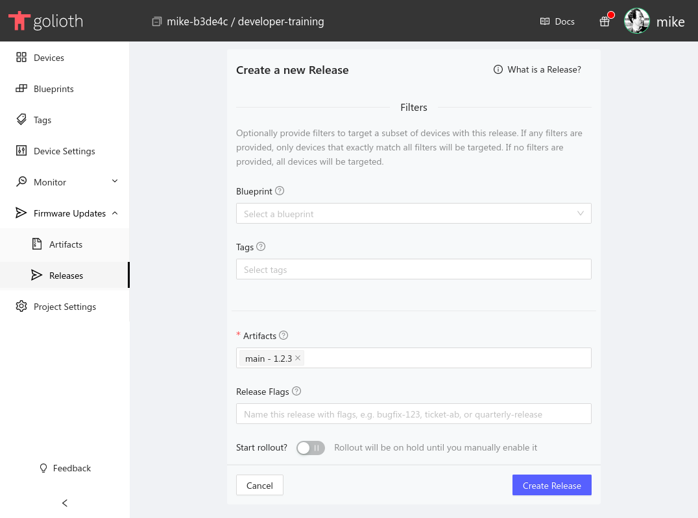
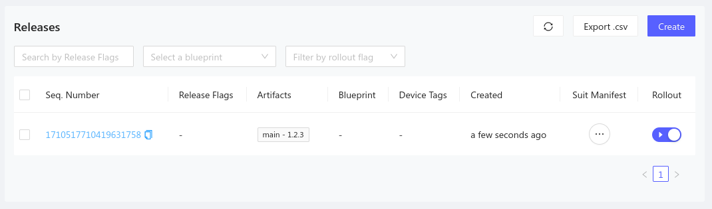

import Tabs from '@theme/Tabs';
import TabItem from '@theme/TabItem';

:::warning Deprecated

Releases have been deprecated in favor of [Cohorts and Deployments](./3-managing-cohorts.md). This page documents the workflow for the old Releases page for projects that haven't been migrated to Cohorts.

:::

To make a firmware update available to your devices, you must first create a
Release. A release is a set of available artifact versions that may optionally
be targeted using Blueprints and Tags.

## Create and roll out a Release

<Tabs
groupId="web_or_cli"
defaultValue="web"
values={[
{label: 'Web Console', value: 'web'},
{label: 'CLI', value: 'cli'},
]}>

<TabItem value="web">

1. Navigate to [the Releases section](https://console.golioth.io/releases) of
   the Golioth Web Console
2. Click the `Create` button
3. Fill in the relevant information
    - Optional: select a device Blueprint. This will limit your available
      Artifacts to only those created with the same Blueprint.
    - Optional: select a Tag. You may assign any number of device tags to target
      the devices notified of this release.
    - Select your Artifacts. Multiple artifacts may be added to a release.
    - Optional: Input release flags. Each flag may only be used on a single
      release.
    - Optional: Select the rollout state. If enabled, devices will be notified
      immediately of the release. This value may be toggled at any time from the
      list of all releases.

    

4. Click the `Create Release` button and the new release will appear in the
   release list. The `Rollout` toggle maybe used at any time to roll out or roll
   back a release.

    

</TabItem>

<TabItem value="cli">

Here is an example of a command to create a release with the artifact that we
created earlier:

```
# Filtering artifacts with nrf91 blueprint
$ goliothctl dfu release create --release-tags v1 --components main@1.0.1 --rollout true --blueprint nrf91
# Without blueprint
$ goliothctl dfu release create --release-tags v1 --components main@1.0.1 --rollout true
```

Now you can check releases and see the release `1.0.0` in the list using the
`goliothctl dfu release list` command:

```
$ goliothctl dfu release list
id:"616880a46c69662e10832873" release_tags:"v1" rollout:true sequence_number:1634238628474218987 blueprint:"nrf91" device_tags:"desk" device_tags:"nb-iot" components:"main@1.0.1"
id:"6168785f6c69662e1083286b" release_tags:"v1" rollout:true sequence_number:1634236511222937406 device_tags:"ethernet" device_tags:"desk" components:"main@1.0.1"
```

</TabItem>
</Tabs>
