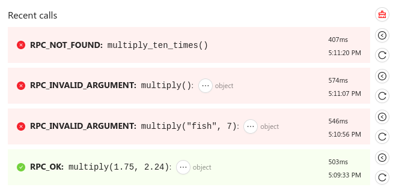

# Using the RPC service

## Configure a device for RPC

We provide an RPC sample application for
[Zephyr](https://github.com/golioth/golioth-firmware-sdk/tree/main/examples/zephyr/rpc)
and for
[ESP-IDF](https://github.com/golioth/golioth-firmware-sdk/tree/main/examples/esp_idf/rpc)
that can be used to test our RPC service. The sample multiplies two numbers
given as input, and returns the result.

## Initiate a Remote Procedure Call

1. Navigate to the [`Devices` list of the Golioth web
   console](https://console.golioth.io/devices) and choose your target device.
2. Select the `Remote Procedure Call` for the device.
3. Input `multiply` as the `Method` name.
4. Click the `+ Add Parameter` button twice to add two input values. Input your
   desired numbers to multiply together.
5. Click the `Call Method` button to initiate the RPC.
6. The result of the RPC will appear under the `Recent Calls` list.

## Check the result of a Remote Procedure Call

The result of your RPC will be shown in the same tab, along with the timestamp
it was issues and the number of milliseconds it took to complete.

To view the return payload, click the `...` button.

## RPC Errors

In the event of an error, the device will return an error code indicating the
reason for the failure (a timeout when the device is not available will also
return an error.)

A complete list of RPC error reasons can be found by viewing the
`golioth_rpc_status` enum in [the Doxygen page for
RPC](https://firmware-sdk-docs.golioth.io/group__golioth__rpc.html).
