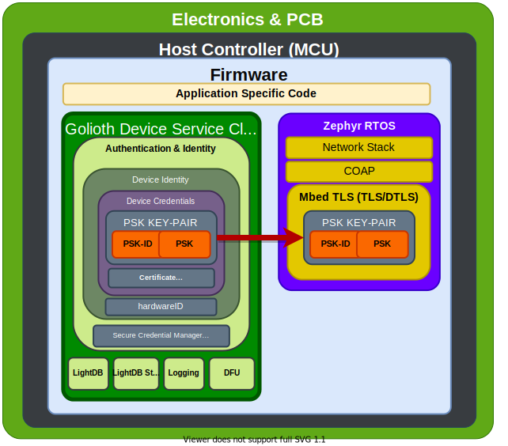

TLS & DTLS are the basis for our device authentication service as well as how the device authenticates a Golioth instance. The diagram below illustrates how the device's PSK keypair, managed by Golioth Auth client, maps to MbedTLS.

At runtime, the Golioth Auth client retrieves the device credentials and provides them to the DTLS client. Currently the client and service support PSK based authentication. Implementation of certificate base asymetric authentication is underway.

