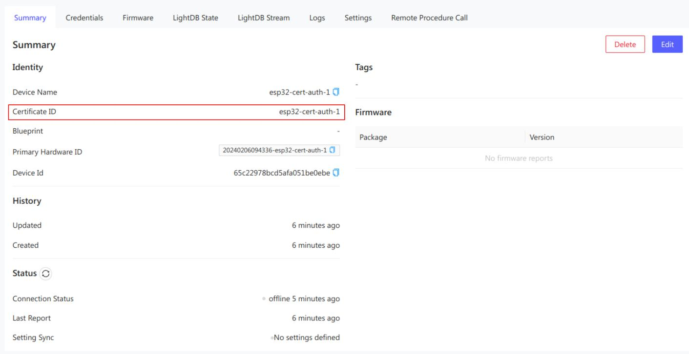

# Certificate Authentication with Golioth

Golioth uses the X.509 standard with the Elliptic Curve Digital Signature
Algorithm (ECDSA) for certificate authentication. This delivers much more
robust security compared to Pre-Shared Key (PSK) authentication.

Certificate authentication also eases the provisioning process. Devices do not
need to be registered with Golioth prior to making the first connection. In
manufacturing, units are granted individual device certificates signed using a
trusted chain of root certificates and intermediate certificates. When the first
connection is authenticated, Golioth will create a unique record of that device
and it will appear as a member of your IoT fleet in your Golioth Project.

## Overview

You can test out Certificate Authentication with the following actions:

* Create a root certificate
* Create device certificates signed using the private root key
* Upload the public root certificate to Golioth
* Provide the device certificate and key to your device

:::note Safeguard your private root key

You retain the **private** root key, it is not shared with Golioth. Only you are
able to sign new device certificates.

:::

## Generate Certificates

### Create a self-signed root certificate

For testing we will use `openssl` to generate a self-signed root certificate.

```shell
SERVER_NAME='golioth'

# Generate an elliptic curve private key
# Run `openssl ecparam -list_curves` to list all available algorithms
# Keep this key safe! Anyone who has it can sign authentic-looking device certificates
openssl ecparam -name prime256v1 -genkey -noout -out "${SERVER_NAME}.key.pem"

# Create and self-sign a corresponding public key / certificate
openssl req -x509 -new -nodes \
    -key "${SERVER_NAME}.key.pem" \
    -sha256 -subj "/C=BR/CN=Root ${SERVER_NAME}" \
    -days 1024 -out "${SERVER_NAME}.crt.pem"
```

This will generate the following files:

* **Signed root certificate:** `golioth.crt.pem`
* **Private root key:** `golioth.key.pem`

### Create and sign device certificates

Now generate and sign a device certificate. The resulting key/crt will be
converted to the `DER` binary format for use with the Golioth Firmware SDK.

```shell
PROJECT_SLUG='your-golioth-projectID'
CERTIFICATE_ID='choose-a-unique-identifier-for-this-device'
SERVER_NAME='golioth'
CLIENT_NAME="${PROJECT_SLUG}-${CERTIFICATE_ID}"

# Generate an elliptic curve private key
openssl ecparam -name prime256v1 -genkey -noout -out "${CLIENT_NAME}.key.pem"

# Create a certificate signing request (CSR)
# (this is what you would normally give to your CA / PKI to sign)
openssl req -new \
    -key "${CLIENT_NAME}.key.pem" \
    -subj "/C=BR/O=${PROJECT_SLUG}/CN=${CERTIFICATE_ID}" \
    -out "${CLIENT_NAME}.csr.pem"

# Sign the certificate (CSR) using the previously generated self-signed root certificate
openssl x509 -req \
    -in "${CLIENT_NAME}.csr.pem" \
    -CA "${SERVER_NAME}.crt.pem" \
    -CAkey "${SERVER_NAME}.key.pem" \
    -CAcreateserial \
    -out "${CLIENT_NAME}.crt.pem" \
    -days 500 -sha256

# Convert device certificates to DER format
openssl x509 -in ${CLIENT_NAME}.crt.pem -outform DER -out ${CLIENT_NAME}.crt.der
openssl ec -in ${CLIENT_NAME}.key.pem -outform DER -out ${CLIENT_NAME}.key.der
```

This will generate the following files:

* **Signed device certificate:** `<projectID>-<certificate-ID>.crt.pem`
* **Signed device certificate (DER):** `<projectID>-<certificate-ID>.crt.der`
* **Certificate Signing Request:** `<projectID>-<certificate-ID>.csr.pem`
* **Private device key:** `<projectID>-<certificate-ID>.key.pem`
* **Private device key (DER):** `<projectID>-<certificate-ID>.key.der`

## Position the certificates

The device certificate and key (both in DER binary format) can now be used with
the device. For simple testing, you can hardcode a certificate to use with our
provided samples. For production, you should provision unique certificates onto each
device.

### Provisioning certificates onto devices

In a production flow, you should provision unique certificates onto each device
as part of your manufacturing process. Once the certificates are on the device,
pass them as part of the configuration when creating the Golioth Client.

As an example, store your client certificate and private key in byte arrays and
pass pointers and array sizes as members of to the Golioth Client configuration:

```c
/* Get the Golioth CA Certificate from the Golioth SDK */
static const uint8_t tls_ca_crt[] = {
#include "golioth-systemclient-ca_crt.inc"
};

int main(void) {
    uint8_t* tls_client_crt = pointer_to_your_crt_der_byte_array;
    uint8_t* tls_client_key = pointer_to_your_key_der_byte_array;
    size_t tls_client_crt_len = sizeof_your_crt_der_byte_array;
    size_t tls_client_key_len = sizeof_your_key_der_byte_array;

    golioth_client_config_t client_config = {
        .credentials = {
            .auth_type = GOLIOTH_TLS_AUTH_TYPE_PKI,
            .pki = {
                .ca_cert = tls_ca_crt,
                .ca_cert_len = sizeof(tls_ca_crt),
                .public_cert = tls_client_crt,
                .public_cert_len = tls_client_crt_len,
                .private_key = tls_client_key,
                .private_key_len = tls_client_key_len,
            }}};

    golioth_client_t client = golioth_client_create(&client_config);

    /* Continue program flow */
}
```

Golioth does not specify the means of provisioning certificates onto a device;
you are free to use whichever method bests fits your device architecture and
manufacturing process. We provide an example of one way to provision
certificates in [the Zephyr-based `certificate_provisioning`
sample](https://github.com/golioth/golioth-firmware-sdk/tree/main/examples/zephyr/certificate_provisioning).

### Upload public root key

Upload the signed root certificate (the public key) to your Golioth project. This
will be used to authenticate each device.

1. Log into the [Golioth Web Console](https://console.golioth.io) and select
   your project
2. Navigate to [`Project Settings` &rarr;
   `Certificates`](https://console.golioth.io/project-settings/certificates)
3. Click `Add a Client Certificate Authority` and upload your `golioth.crt.pem`
   file.


:::caution

Do not upload the `golioth.key.pem` file. This is your private key used to sign
new device credentials and you are the only one who should have access to it.

:::

## Connect your device

With the public root certificate uploaded to Golioth, and the device
certificate/key in use in your firmware, your device will automatically connect
and authenticate to your project. Look in the [Golioth Web
Console](https://console.golioth.io) to verify a device with a name that either matches or is prefixed by the `CERTIFICATE_ID` you supplied when creating the device credential:


But note that the Device Name attribute is mutable and you can change it to another name at any time. The important field to correctly associate your device to that certificate is the **immutable** Certificate ID field shown in the Summary Page of the device. Click on the device name link to see the summary page as follows:



This Certificate ID field is unique across an entire project and is used to associate a device with a certificate during authentication.
