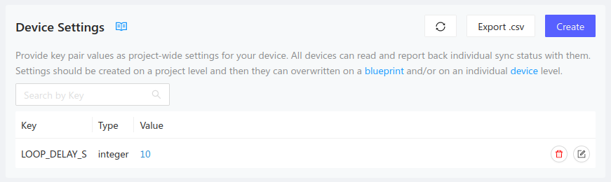

The Golioth Device Settings Service enables you to update settings for all
devices in your fleet at the same time. The service can also target device
groups by hardware blueprint, and by individual device. This is ideal for common
settings like the delay between sensor readings or adjusting the remote logging
messages by turning them on/off and setting the device's logging level.

|  |
| -- |
| Once the firmware is running, device settings can be updated using [the Golioth Console](https://console.golioth.io) (shown above) or via calls to our REST API. |

## Includes

```c
#include "golioth.h"
```

Including the `golioth.h` header file makes the Golioth API functions available
to your program.

### Registering a callback

```c
// Define min and max acceptable values for setting
#define LOOP_DELAY_S_MIN 1
#define LOOP_DELAY_S_MAX 300

// Register Device Settings service callback
golioth_settings_register_int_with_range(client,
                                         "LOOP_DELAY_S",
                                         LOOP_DELAY_S_MIN,
                                         LOOP_DELAY_S_MAX,
                                         on_loop_delay_setting,
                                         NULL);
```

Choose from the `golioth_settings_register_<type>()` API functions to register a
callback that will execute asynchronously when receiving device settings service
updates from the Golioth Cloud. Here we see a callback that expects an integer
and will test the received valued for a specific valid range.

There are also API calls that register to receive a boolean value, a string, or
an integer without applying a range check:

```c
golioth_settings_register_bool(client,
                               "ENABLE_EXT_SENSOR",
                               on_ext_sensor_setting,
                               NULL);
```

Required parameters are the Golioth Client object, the settings key, and the
name of the callback function. An optional callback argument may be specified,
this data will be available in the callback function.

The Golioth servers will send an update when the callback is first registered
and each time data changes on the cloud. When the response is received from
Golioth, the registered callback will run, allowing you to validate and react to
the settings.

### Callback function

```c
// Global veriable to store received settings
int32_t _loop_delay_s = 10;

static golioth_settings_status_t on_loop_delay_setting(int32_t new_value, void* arg) {
    LOG_INF("Setting loop delay to %" PRId32 " s", new_value);
    _loop_delay_s = new_value;
    return GOLIOTH_SETTINGS_SUCCESS;
}
```

The callback is responsible for returning a status message to the Golioth
servers indicating that the setting was received and processed, or indicating a
reason why it was not. Once data is validated, the setting may be acted upon and
a `GOLIOTH_SETTINGS_SUCCESS` response returned. There are a number of different
settings-specific statuses that can be returned. Please see the
`golioth_settings_status_t` enumeration [in the Golioth Firmware SDK
reference](https://firmware-sdk-docs.golioth.io/group__golioth__settings.html)
for more information.

## Golioth Device Settings examples

See the [Golioth Firmware
SDK](https://github.com/golioth/golioth-firmware-sdk/tree/main/examples) for
examples of using settings across platforms.

## Resources

Further documentation of the device SDK is available in the [Golioth Firmware
SDK
Reference](https://firmware-sdk-docs.golioth.io/group__golioth__settings.html)
(Doxygen).
