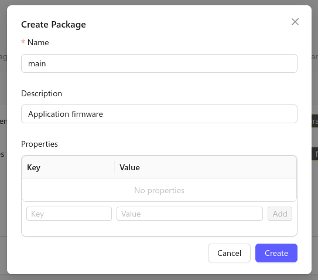

Over-the-Air (OTA) updates are a type of Device Firmware Upgrade (DFU). In this
page we'll walk through the FW Update sample found in [the Zephyr
port of the Golioth Firmware
SDK](https://github.com/golioth/golioth-zephyr-sdk/tree/main/samples/fw_update),
which shows how to use the Golioth OTA update service.

We will target the Nordic nRF9160dk (Using the NCS version of Zephyr), however
these step are portable to all other supported boards.

## Overview

### Expected Outcome

By the end of this page your device will download, verify, install, and run an
updated firmware version and report the results to the Golioth Console.

### OTA Update Sample Workflow

1. Add hardcoded credentials
2. Build and flash the initial FW Update sample application
3. Upload the signed/versioned firmware as an artifact
4. Create a release from the artifact and roll it out to the device
5. Observe the device reporting the update version number

## Running the OTA Sample

### 1. Add hardcoded credentials

Navigate to the Golioth module in your zephyr install. This will be the
`/modules/lib/golioth-firmware-sdk` directory.

Add the Golioth device PSK-ID and PSK to the project `prj.conf` file:

```cfg
CONFIG_GOLIOTH_SAMPLE_PSK_ID="my-psk-id"
CONFIG_GOLIOTH_SAMPLE_PSK="my-psk"
```

:::tip Where do I find my device credentials?

Credentials can be copied from the Device details page in the [Golioth
Console](https://console.golioth.io).

:::

### 2. Initial build and flash

```console
west build -b nrf9160dk/nrf9160/ns --sysbuild examples/zephyr/fw_update
west flash
```

By default this will build and run version `v1.2.3` firmware on the Nordic
nRF9160 development kit.

:::

### 3. Rebuild firmware with new version number

Now update the firmware version in the project `prj.conf` file:

```cfg
CONFIG_MCUBOOT_IMGTOOL_SIGN_VERSION="1.2.4"
```

Then build the application a second time.

```console
west build -b nrf9160dk/nrf9160/ns --sysbuild examples/zephyr/fw_update
```

:::note

Do not run the west flash command. We will upload this binary to the
Golioth Console and it will be loaded on the device via Over-The-Air (OTA)
update.

:::

### 4. Create a Package

The Golioth Cloud represents upgradeable software components as "Packages". In
the OTA sample code, the package for the application firmware is called "main",
so we'll need to create a corresponding package in the Golioth Console.

In the Golioth Console, go to **Firmware Updates&rarr;Packages** on the left
sidebar and click the Create button. Set the name of the package to `main`, and
optionally add a short description.



### 5. Upload the firmware binary

The binary we built is located at `build/zephyr/app_update.bin` and can now be
used to create a new version of the `main` package on the Golioth Console.

In the Golioth Console, go to **Firmware Updates&rarr;Packages** in the left
sidebar and open the `main` package in the list of packages, then click `New
Version`.


* Set the **Artifact Version to 1.2.6** (to match what was compiled into the
  firmware)
* Click the upload button in the middle of the window and choose your
  `golioth_basics.bin` file.
* Click the **Upload Artifact** button to finish creating an artifact.

### 6. Assign the device to a Cohort

To enroll your device into Golioth's OTA update system, you need to assign it to
a Cohort. Cohorts are groups of devices that have the same firmware and receive
the same OTA updates.

First, we need to create a new Cohort for this device type. In the Golioth
Console, go to **Firmware Updates&rarr;Cohorts** in the left sidebar and click
the Create button. Select a name for your Cohort and click `Create`.

Next, we need to assign our device to this new Cohort. In the Cohort page, click
`Add Devices`, and find your device in the list. Click the Add button on the
right hand side of the device to assign it to the Cohort.


### 7. Create a deployment

OTA updates are rolled out to a Cohort as Deployments. To start a new update for
our device, go to the Cohort's page in the Golioth Console and click `Deploy`.
Add the `main` package to the deployment, and make sure it's set to version
1.2.6. You can optionally pick a name for your deployment.


Click `Next` to review your deployment, then `Start Deployment` to start the
update.

### 8. Verify the new version

By default, the device will use MCUboot to verify the signature of new firmware
and ensure that it can be run before switching. Once the new version is running,
the device will report the version to Golioth which can be viewed in the
Firmware tab of the Golioth Console.


## Summary

Over-the-Air updates are one of the most powerful tools in IoT. Running the
Golioth FW Update sample application has demonstrated how the firmware updates
are compiled and versioned, the process for creating the artifact and deployment
on the Golioth Console, and the device reporting back a new version number after
a successful update.

:::note Do not use hardcoded credential in practice

The Golioth FW Update sample uses hardcoded PSK credentials to simplify the
example code. An alternate option must be used when more than one device is
receiving an update (e.g. device certificate authentication stored in persistent
memory). This will ensure that credentials specific to each device are not
overwritten by hardcoded values present in the update.

:::

:::note Binaries signed with a default key

This sample uses the default MCUboot key for signing. For production devices,
you must generate your own key to sign the binary files.

:::
