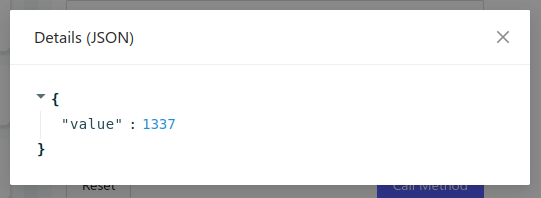

The Golioth Remote Procedure Call (RPC) allows a server-side command to execute
a function on the remote device, including supplying input parameters and
receiving output data from the function. RPC is handy for things like executing
a device reset, or running a function with input that was not available at
compile time.

## Includes

```c
#include "golioth.h"
```

Including the `golioth.h` header file makes the Golioth API functions available
to your program.

### Registering a callback

```c
int err = golioth_rpc_register(client, "multiply", on_multiply, NULL);
```

Use the `golioth_rpc_register()` function to register a callback that will
execute asynchronously when an RPC request is received from the Golioth Cloud.
Required parameters are the Golioth Client object, the method name (as a
string), the name of the callback function, and an optional user-defined
parameter.

### Callback function

```c
static golioth_rpc_status_t on_multiply(
    zcbor_state_t* request_params_array,
    zcbor_state_t* response_detail_map,
    void* callback_arg) {
    double a, b;
    double value;
    bool ok;

    ok = zcbor_float_decode(request_params_array, &a)
        && zcbor_float_decode(request_params_array, &b);
    if (!ok) {
        LOG_ERR("Failed to decode array items");
        return RPC_INVALID_ARGUMENT;
    }

    value = a * b;

    LOG_DBG("%lf * %lf = %lf", a, b, value);

    ok = zcbor_tstr_put_lit(response_detail_map, "value")
      && zcbor_float64_put(response_detail_map, value);
    if (!ok) {
        LOG_ERR("Failed to encode value");
        return RPC_RESOURCE_EXHAUSTED;
    }

    return GOLIOTH_RPC_OK;
}
```

Golioth uses [CBOR](http://cbor.io/) serialization to transfer RPC information
between the device and the server. This conserves bandwidth and radio-on time
(battery) by keeping the data transfer as small as possible.

If input parameters were included in the RPC message they can be extracted from
the `request_params_array` object. Any return values should be encoded in the
`response_detail_map`.

The callback is responsible for returning the `GOLIOTH_RPC_OK` status message to
the Golioth servers indicating that the RPC was successful, or an error status
indicating why it was not. There are a number of different error status messages
that can be returned. View the `golioth_rpc_status` enumeration [in the Golioth
Firmware SDK
reference](https://firmware-sdk-docs.golioth.io/group__golioth__rpc.html) for
more information.

## Summary


Once the firmware is running, an RPC request can be sent from the device-level
"Remote Procedure Call" tab in [the Golioth Console](https://console.golioth.io)
(shown above) or via a call to our REST API.



The status of the RPC request is shown in the same tab. The response can be
viewed by clicking the three-dot button in the "Recent calls" list.

## Example in the Golioth Basics Application

The `multiply` remote procedure call is demonstrated [in the Golioth RPC
example
application](https://github.com/golioth/golioth-firmware-sdk/tree/main/examples/zephyr/rpc).

## Resources

Further documentation of the device SDK is available in the [Golioth Firmware
SDK Reference](https://firmware-sdk-docs.golioth.io/group__golioth__rpc.html)
(Doxygen).
