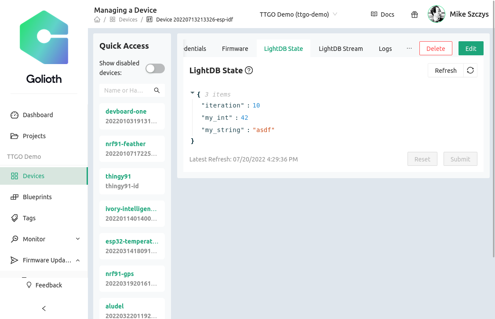
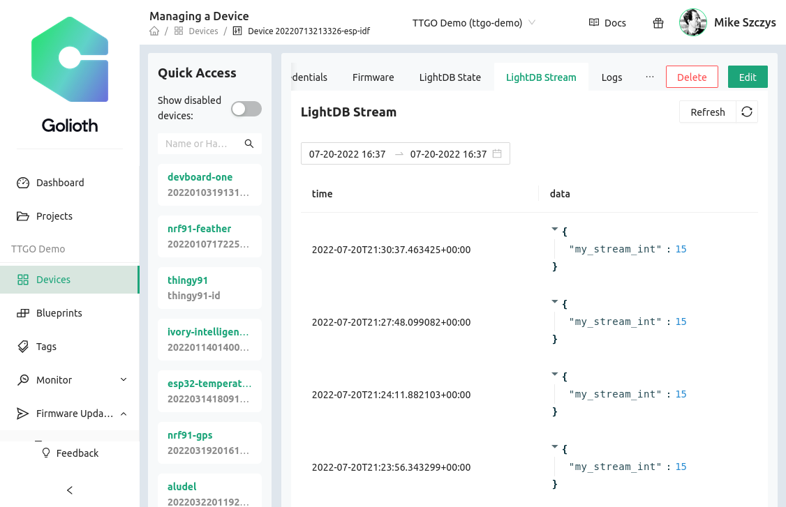
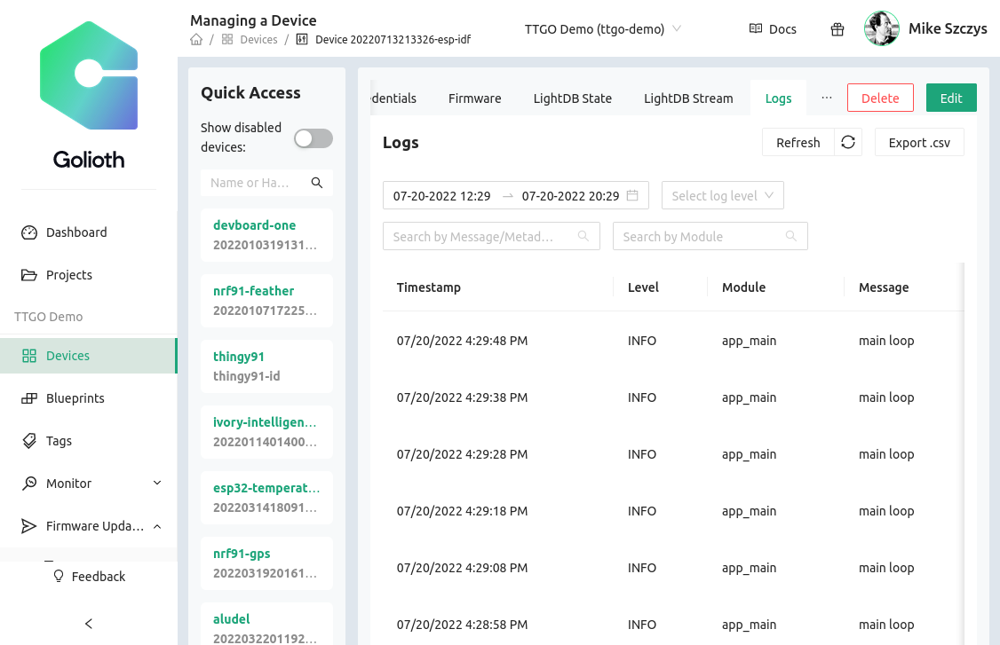

The `golioth_basics` sample sent several different types of data to the Golioth
Cloud. Included are LightDB State (persistent data), LightDB Stream (time-series
data), and Log messages. All of these can be view from [the Golioth Web
Console](https://console.golioth.io).

### Viewing LightDB State data



State data shows the last updated value for each endpoint. The example app
updates the "iteration" endpoint every 10 seconds; what is shown is the most
recent value of that counter. The example app also sets the "my_string" and
"my_data" endpoints once at run time.

```code
golioth_lightdb_set_int_async(client, "iteration", iteration, NULL, NULL);
golioth_lightdb_set_string_sync(client, "my_string", "asdf", 4, 5);
golioth_lightdb_set_int_async(client, "my_int", 42, NULL, NULL);
```

All of these calls are well-documented in the comments of the example app's
`main.c` file.

### Viewing LightDB Stream data



Streaming data is sent just one time in this app. The view shown here is the
result of restarting the device multiple times. Notice that the timestamp
automatically applied to this data can be used to indiate the time of each
reboot.

```code
golioth_lightdb_stream_set_int_async(client, "my_stream_int", 15, NULL, NULL);
```

### Viewing Logs on the Golioth Web Console



You can see in the Log view the example app sends a "main loop" message every 10
seconds using this command:

```c
golioth_log_info_async(client, "app_main", "main loop", NULL, NULL);
```

### Viewing Data with the `goliothctl` command line tool

It is also possible to view all of this data via the Golioth command line tools. As an example, this command shows the last minute of logs:

```console
$ goliothctl logs --interval 1m
[2022-07-20T22:06:57Z] level:INFO  module:"app_main"  message:"main loop"  device_id:"62cf3a26f810c89ed3002af0" metadata:"{}"
[2022-07-20T22:07:02Z] level:INFO  module:"app_main"  message:"Hello, World!"  device_id:"62cf3a26f810c89ed3002af0" metadata:"{}"
[2022-07-20T22:07:02Z] level:WARN  module:"app_main"  message:"Sync log"  device_id:"62cf3a26f810c89ed3002af0" metadata:"{}"
[2022-07-20T22:07:02Z] type:DIAGNOSTICS  level:INFO  module:"golioth_dfu"  message:"main(IDLE): ready state"  device_id:"62cf3a26f810c89ed3002af0" metadata:"{"package":"main","reason":"ready state","reasonCode":"0","state":"IDLE","stateCode":"0","target":"","time":"2022-07-20T22:07:02.788082332Z","version":"1.2.3"}"
[2022-07-20T22:07:06Z] level:INFO  module:"app_main"  message:"main loop"  device_id:"62cf3a26f810c89ed3002af0" metadata:"{}"
[2022-07-20T22:07:13Z] level:INFO  module:"app_main"  message:"main loop"  device_id:"62cf3a26f810c89ed3002af0" metadata:"{}"
[2022-07-20T22:07:23Z] level:INFO  module:"app_main"  message:"main loop"  device_id:"62cf3a26f810c89ed3002af0" metadata:"{}"
[2022-07-20T22:07:33Z] level:INFO  module:"app_main"  message:"main loop"  device_id:"62cf3a26f810c89ed3002af0" metadata:"{}"
[2022-07-20T22:07:45Z] level:INFO  module:"app_main"  message:"Hello, World!"  device_id:"62cf3a26f810c89ed3002af0" metadata:"{}"
[2022-07-20T22:07:45Z] level:WARN  module:"app_main"  message:"Sync log"  device_id:"62cf3a26f810c89ed3002af0" metadata:"{}"
[2022-07-20T22:07:45Z] type:DIAGNOSTICS  level:INFO  module:"golioth_dfu"  message:"main(IDLE): ready state"  device_id:"62cf3a26f810c89ed3002af0" metadata:"{"package":"main","reason":"ready state","reasonCode":"0","state":"IDLE","stateCode":"0","target":"","time":"2022-07-20T22:07:45.765798699Z","version":"1.2.3"}"
[2022-07-20T22:07:46Z] level:INFO  module:"app_main"  message:"main loop"  device_id:"62cf3a26f810c89ed3002af0" metadata:"{}"
```

You can also filter logs. Here is a similar output, but we've filtered to shown only `WARN` level logs and above.

```console
$ goliothctl logs --interval 5m --level WARN
[2022-07-20T22:07:02Z] level:WARN  module:"app_main"  message:"Sync log"  device_id:"62cf3a26f810c89ed3002af0" metadata:"{}"
[2022-07-20T22:07:45Z] level:WARN  module:"app_main"  message:"Sync log"  device_id:"62cf3a26f810c89ed3002af0" metadata:"{}"
```
