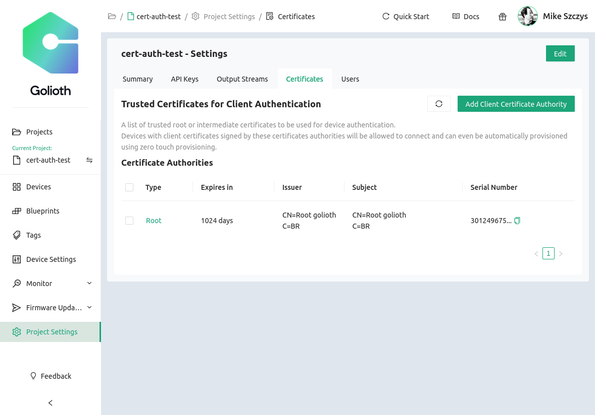
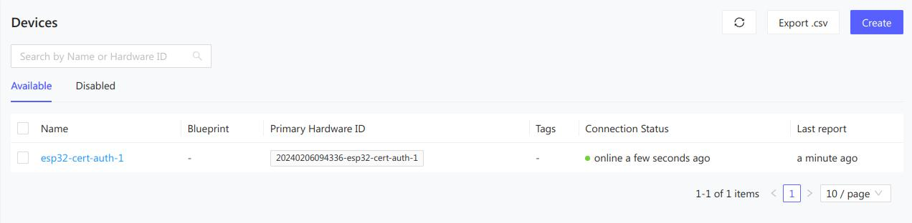

# Certificate Authentication with Golioth

Golioth uses the X.509 standard with the Elliptic Curve Digital Signature
Algorithm (ECDSA) for certificate authentication. This delivers much more
robust security compared to Pre-Shared Key (PSK) authentication.

Certificate authentication also eases the provisioning process. Devices do not
need to be registered with Golioth prior to making the first connection. In
manufacturing, units are granted individual device certificates signed using a
trusted chain of root certificates and intermediate certificates. When the first
connection is authenticated, Golioth will create a unique record of that device
and it will appear as a member of your IoT fleet in your Golioth Project.

## Overview

You can test out Certificate Authentication with the following actions:

* Create a root certificate
* Create device certificates signed using the private root key
* Upload the public root certificate to Golioth
* Provide the device certificate and key to your device

:::note Safeguard your private root key

You retain the **private** root key, it is not shared with Golioth. Only you are
able to sign new device certificates.

:::

## Generate Certificates

### Create a self-signed root certificate

For testing we will use `openssl` to generate a self-signed root certificate.

```shell
SERVER_NAME='golioth'

# Generate an elliptic curve private key 
# Run `openssl ecparam -list_curves` to list all available algorithms
# Keep this key safe! Anyone who has it can sign authentic-looking device certificates
openssl ecparam -name prime256v1 -genkey -noout -out "${SERVER_NAME}.key.pem"

# Create and self-sign a corresponding public key / certificate
openssl req -x509 -new -nodes \
    -key "${SERVER_NAME}.key.pem" \
    -sha256 -subj "/C=BR/CN=Root ${SERVER_NAME}" \
    -days 1024 -out "${SERVER_NAME}.crt.pem"
```

This will generate the following files:

* **Signed root certificate:** `golioth.crt.pem`
* **Private root key:** `golioth.key.pem`

### Create and sign device certificates

Now generate and sign a device certificate. The resulting key/csr will be
converted to the `DER` binary format for use with the Golioth Zephyr SDK.

```shell
PROJECT_SLUG='your-golioth-projectID'
PRIMARY_HARDWARE_ID='choose-hardware-id-for-this-device'
SERVER_NAME='golioth'
CLIENT_NAME="${PROJECT_SLUG}-${PRIMARY_HARDWARE_ID}"

# Generate an elliptic curve private key
openssl ecparam -name prime256v1 -genkey -noout -out "${CLIENT_NAME}.key.pem"

# Create a certificate signing request (CSR)
# (this is what you would normally give to your CA / PKI to sign)
openssl req -new \
    -key "${CLIENT_NAME}.key.pem" \
    -subj "/C=BR/O=${PROJECT_SLUG}/CN=${PRIMARY_HARDWARE_ID}" \
    -out "${CLIENT_NAME}.csr.pem"

# Sign the certificate (CSR) using the previously generated self-signed root certificate
openssl x509 -req \
    -in "${CLIENT_NAME}.csr.pem" \
    -CA "${SERVER_NAME}.crt.pem" \
    -CAkey "${SERVER_NAME}.key.pem" \
    -CAcreateserial \
    -out "${CLIENT_NAME}.crt.pem" \
    -days 500 -sha256

# Convert device certificates to DER format
openssl x509 -in ${CLIENT_NAME}.crt.pem -outform DER -out ${CLIENT_NAME}.crt.der
openssl ec -in ${CLIENT_NAME}.key.pem -outform DER -out ${CLIENT_NAME}.key.der
```

This will generate the following files:

* **Signed device certificate:** `<projectID>-<primary-hardware-ID].crt.pem`
* **Signed device certificate (DER):** `<projectID>-<primary-hardware-ID>.crt.der`
* **Certificate Signing Request:** `<projectID>-<primary-hardware-ID>.csr.pem`
* **Private device key:** `<projectID>-<primary-hardware-ID>.key.pem`
* **Private device key (DER):** `<projectID>-<primary-hardware-ID>.key.der`

## Position the certificates

The device certificate and key (both in DER binary format) can now be used with
the device. For simple testing, you can hardcode a certificate to use with our
provided samples. For production, you should provision unique certificates onto each
device.

### Hardcoding for samples

All of our samples can be compiled with hardcoded certificate credentials. As an
example, build the Golioth `hello` sample code.

:::note For prototyping only

Using a hardcoded certificate is an easy way to start using and test
certificate based authentication. It should not be used in production.

:::

1. Set the project to use Certificate Authentication

    As outlined in the [Certificate based auth
    section](https://github.com/golioth/golioth-zephyr-sdk/tree/main/samples/hello#certificate-based-auth)
    of that sample's README, a few Kconfig symbols need to be set in the
    `prj.conf` file:

    ```
    CONFIG_GOLIOTH_AUTH_METHOD_CERT=y
    CONFIG_GOLIOTH_SAMPLE_HARDCODED_CRT_PATH="keys/device.crt.der"
    CONFIG_GOLIOTH_SAMPLE_HARDCODED_KEY_PATH="keys/device.key.der"
    ```
2. Build and flash the firmware following the instructions in the [README](https://github.com/golioth/golioth-zephyr-sdk/tree/main/samples/hello).

### Provisioning certificates

In a production flow, you should provision unique certificates onto each device as
part of your manufacturing process. Once the certificates are on the device, you
need to load them into the [Zephyr TLS Credential Store](https://docs.zephyrproject.org/apidoc/latest/group__tls__credentials.html). As an example, if your client certificate and private
key are stored in the byte arrays `tls_client_crt` and `tls_private_key` (respectively):

```C
tls_credential_add(CONFIG_GOLIOTH_SYSTEM_CLIENT_CREDENTIALS_TAG,
                   TLS_CREDENTIAL_SERVER_CERTIFICATE,
                   tls_client_crt, ARRAY_SIZE(tls_client_crt));
tls_credential_add(CONFIG_GOLIOTH_SYSTEM_CLIENT_CREDENTIALS_TAG,
                   TLS_CREDENTIAL_PRIVATE_KEY,
                   tls_private_key, ARRAY_SIZE(tls_private_key));
```

Golioth does not specify the means of provisioning certificates onto a device; you are
free to use whichever method bests fits your device architecture and manufacturing
process. We provide an example of one way to provision certificates in the
`certificate_provisioning` sample.

### Upload public root key

Upload the signed root certificate (the public key) to your Golioth project. This
will be used to authenticate each device.

1. Log into the [Golioth Web Console](https://console.golioth.io) and select
   your project
2. Navigate to [`Project Settings` &rarr;
   `Certificates`](https://console.golioth.io/project-settings/certificates)
3. Click `Add a Client Certificate Authority` and upload your `golioth.crt.pem`
   file.



:::caution

Do not upload the `golioth.key.pem` file. This is your private key used to sign
new device credentials and you are the only one who should have access to it.

:::

## Connect your device

With the public root certificate uploaded to Golioth, and the device
certificate/key in use in your firmware, your device will automatically connect
and authenticate to your project. Look in the [Golioth Web
Console](https://console.golioth.io) to verify a device matching the
`PRIMARY_HARDWARE_ID` you supplied when creating device credentials is now
present:


