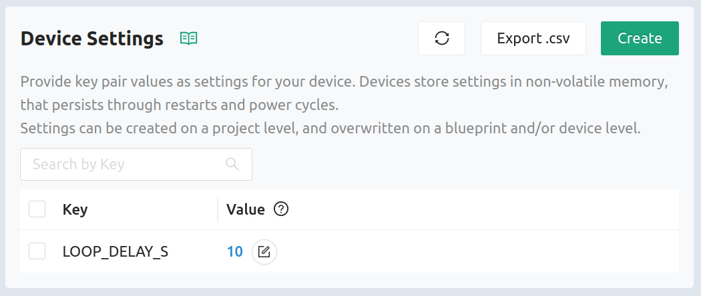

The Golioth Device Settings Service enables you to update settings for all
devices in your fleet at the same time. The service can also target device
groups by hardware blueprint, and individual devices. This is ideal for common
settings like the delay between sensor readings or adjusting the remote logging
messages by turning them on/off and setting the device's logging level.

## Includes

```c
#include <net/golioth/system_client.h>
#include <net/golioth/settings.h>
```

Including the Golioth System Client and the Golioth Settings header files makes
the Golioth API functions available to your program.

### Registering a callback

```c
static void golioth_on_connect(struct golioth_client *client)
{
	int err = golioth_settings_register_callback(client, on_setting);

	if (err) {
		LOG_ERR("Failed to register settings callback: %d", err);
	}
}
```

Use the `golioth_settings_register_callback()` function to register a callback
that will execute asynchronously when receiving device settings service updates
from the Golioth Cloud. Required parameters are the Golioth Client object and the
name of the callback function, the API takes care of the rest.

The Golioth servers will send an update when the callback is first registered
and each time data changes on the cloud. When the response is received from
Golioth, the registered callback will run, allowing you to validate and react to
the settings.

:::tip Register device settings service callbacks whenever connected

We recommend that this callback be registered in the `client->on_connect`
callback that runs each time the device connects to Golioth. This way, the
device will receive endpoint data at every reconnect as well as whenever data
changes on the cloud.

:::

### Callback function

```c
enum golioth_settings_status on_setting(
		const char *key,
		const struct golioth_settings_value *value)
{
	LOG_DBG("Received setting: key = %s, type = %d", key, value->type);
	if (strcmp(key, "LOOP_DELAY_S") == 0) {
		/* This setting is expected to be numeric, return an error if it's not */
		if (value->type != GOLIOTH_SETTINGS_VALUE_TYPE_INT64) {
			return GOLIOTH_SETTINGS_VALUE_FORMAT_NOT_VALID;
		}

		/* This setting must be in range [1, 100], return an error if it's not */
		if (value->i64 < 1 || value->i64 > 100) {
			return GOLIOTH_SETTINGS_VALUE_OUTSIDE_RANGE;
		}

		/* Setting has passed all checks, so apply it to the loop delay */
		_loop_delay_s = (int32_t)value->i64;
		LOG_INF("Set loop delay to %d seconds", _loop_delay_s);

		return GOLIOTH_SETTINGS_SUCCESS;
	}

	/* If the setting is not recognized, we should return an error */
	return GOLIOTH_SETTINGS_KEY_NOT_RECOGNIZED;
}
```

Golioth uses key/value pairs to pass settings service data. Above you can see
the callback tests for the `LOOP_DELAY_S` key before validating the value type
and range.

The callback is responsible for returning a status message to the Golioth
servers indicating that the settings was received and processed, or indicating a
reason why it was not. Once data is validated, the setting may be acted upon and
a `GOLIOTH_SETTINGS_SUCCESS` response returned. There are a number of different
error status' that can be returned. View the `golioth_settings_status`
enumeration [in the Golioth Zephyr SDK
reference](https://zephyr-sdk-docs.golioth.io/group__golioth__settings.html) for
more information.

## Summary



Once the firmware is running, device settings can be updated using [the Golioth
Console](https://console.golioth.io) (shown above) or via calls to our REST API.

The best example of the Device Settings Service is found in [the Settings sample
code](https://github.com/golioth/golioth-zephyr-sdk/tree/main/samples/settings).

Further documentation of the device SDK is available in the [Golioth Zephyr SDK
Reference](https://zephyr-sdk-docs.golioth.io/) (Doxygen).
