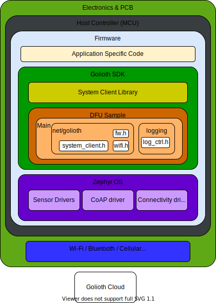

This is a guide to implementing firmware updates for embedded devices using the Golioth Device Firmware Update (DFU) service. It is recommended but not necessary to become familiar with the individual components involved in the service which are described in the DFU overview document in detail. Working through the [Getting Started Guide](https://docs.golioth.io/getting-started) is also a prerequisite to ensure that the necessary tooling is place to build and implement this solution.

The following diagram illustrates the architecture of the sample within the Device SDK architecture. The DFU sample can be found in the [Golioth zephyr-sdk repository](https://github.com/golioth/golioth-zephyr-sdk/tree/main/samples/dfu).

## Implementation

* Create a device with credentials in the Golioth console
* Build and flash MCUBoot for the target board
  * If building firmware using the Nordic SDK, this step is integrated into the application build
  * If building firmware using stock Zephyr and/or custom targets, this step will be done separately
* Build and flash the application utilizing the DFU API and applying the device credentials
* Build (but don't flash) the application specifying an alternative firmware image version from the previous
* Upload the alternative image version to Golioth Console and prepare it for release
  
All devices running the DFU service will automatically download the release candidate and update the firmware.

[//]: # (Go into detail regarding use of the API in a modular fashion. Detail the process of adding the DFU components to a standard )
[//]: # (sample application like Blinky to encourage the distinguishing of the API from the DFU sample.  Provide some insight into)   
[//]: # (the system_client.c functions that enable the DFU service.)

