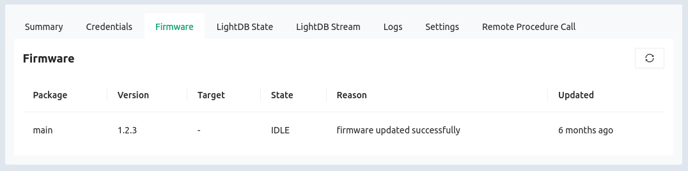

import Deprecated from '/docs/_partials-common/deprecation-warning-zephyr-sdk.md'

<Deprecated/>

Over-the-Air (OTA) updates are a type of Device Firmware Upgrade (DFU); for this
sample let's consider the two terms synonymous. In this page we'll walk through
the DFU sample found in [the Golioth Zephyr (and NCS)
SDK](https://github.com/golioth/golioth-zephyr-sdk/tree/main/samples/dfu).

We will target the Nordic nRF9160dk, however these step are portable to all
other supported boards.

## Overview

### Expected Outcome

By the end of this page your device will download, verify, install, and run an
updated firmware version and report the results to the Golioth Console.

### OTA Update Sample Workflow

1. Build and flash the initial DFU sample application
2. Use the serial shell to set the device credentials
3. Rebuild the firmware with new version number (the update)
4. Upload the signed/versioned firmware as an artifact
5. Create a release from the artifact and roll it out to the device
6. Observe the device reporting the update version number

## Running the OTA Sample

### 1. Initial build and flash

Navigate to the Golioth module in your zephyr install. If you followed [Golioth
NCS Build
Environment](/getting-started/device-examples/compile-example-code/zephyr-ncs)
this will be in the `golioth-ncs-workspace/module/lib/golioth` directory. Build
and flash the sample code.

```bash
west build -b nrf9160dk_nrf9160_ns samples/dfu -p
west flash
```

This will build and run `v0.0.0` firmware on the Nordic nRF9160 development kit.

:::note Building and flashing MCUboot to other devices

Images for Nordic targets are automatically signed during the build process and
do not require an extra manual step for signing.

<details>
<summary>Click to reveal details on MCUboot and signing binaries</summary>

The README in the Golioth DFU sample discusses [building MCUBoot for other architectures](https://github.com/golioth/golioth-zephyr-sdk/tree/main/samples/dfu#using-with-zephyr).

Signing application code is also discussed in the sample's README. It should
follow a process similar to the following:

```bash
# After building your app image, sign the binary:
west sign -t imgtool -- --key WEST_ROOT/bootloader/mcuboot/root-rsa-2048.pem
# Flash a signed app to a device already running the MCUboot bootloader:
west flash --bin-file build/zephyr/zephyr.signed.bin --hex-file build/zephyr/zephyr.signed.hex
```

</details>

:::

### 2. Pass credentials to the device

The Golioth DFU sample stores the device credentials in the settings partition
of device. Use a serial terminal to connect to the nRF9160dk. The `settings set` command should be used to set `golioth/psk-id` and `golioth/psk`.

You will receive confirmation after setting each of these values:

```bash
uart:~$ settings set golioth/psk-id my-device@my-project
Setting golioth/psk-id to my-device@my-project
Setting golioth/psk-id saved as my-device@my-project
uart:~$ settings set golioth/psk my_strong_password
Setting golioth/psk to my_strong_password
Setting golioth/psk saved as my_strong_password
uart:~$
```

:::tip Where do I find my device credentials?
Credentials can be copied from the Device details page in the [Golioth
Console](https://console.golioth.io).
:::

### 3. Rebuild firmware with new version number

Now build the application a second time. Adding the
`-DCONFIG_MCUBOOT_IMAGE_VERSION` flag incorporates a new version number in the
firmware.

```bash
west build -p -b nrf9160dk_nrf9160_ns samples/dfu -- -DCONFIG_MCUBOOT_IMAGE_VERSION=\"1.2.3\"
```

:::note
Do not run the west flash command. We will upload this binary to the
Golioth Console and it will be loaded on the device via Over-The-Air (OTA)
update.
:::

### 4. Upload new firmware to the Golioth Console

The new binary is located at `build/zephyr/app_update.bin` and can now be used
to create an artifact on the Golioth Console.

1. Log into the Golioth Console
2. Navigate to `Firmware-Updates`&rarr;`Artifacts` menu and click the `Create` button
3. Enter the version number you used at compile time into the `Artifact Version`
   box
4. Click the upload icon and choose your app_update.bin file
5. Click `Upload Artifact`

### 5. Create a release and rollout the firmware update

You must create a release based on the artifact you just uploaded, then rollout
that release to tell your devices there is an update available.

1. Log into the Golioth Console
2. Navigate to `Firmware-Updates`&rarr;`Releases` menu and click the `Create` button
3. Choose your newly updated artifact from the `Artifacts` dropdown box, then
   click `Create Release`
4. You will see a list of releases, click the `Rollout` button next to your new
   release.

Each time the device establishes an active connection with the Golioth Cloud it
will compare the firmware version currently running with what is available from
the server. Newer firmware releases will be automatically downloaded, verified,
and flashed to the device.

### 6. Verify the new version

By default, the device will use MCUboot to verify the signature of new firmware
and ensure that it can be run before switching. Once the new release is running,
the device will report the version to Golioth which can be viewed in the
Firmware tab of the Golioth Console.



## Summary

Over-the-Air updates are one of the most powerful tools in IoT. Running [the
Golioth DFU sample
application](https://github.com/golioth/golioth-zephyr-sdk/tree/main/samples/dfu)
has demonstrated how the firmware updates are compiled and versioned, the
process for creating the artifact and rollout on the Golioth Console, and the
device reporting back a new version number after a successful update.
