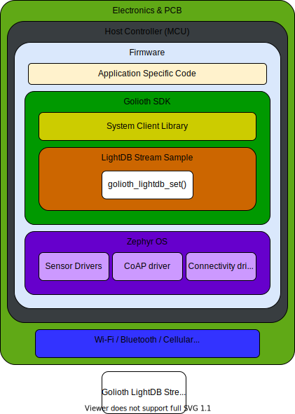

LightDB Stream is a persistent database service hosted by Golioth. The LightDB Stream service can be used to create time series data that can be extracted using utilities described in the [Cloud](https://docs.golioth.io/cloud) section of the Golioth documentation.

Checkout the [LightDB Stream](https://docs.golioth.io/cloud/services/lightdb-stream/) guide for a walkthrough of the sample demonstrating the firmware calls used to interact with the Golioth LightDB Stream service. 