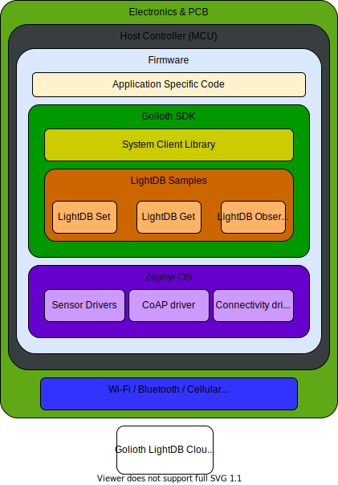

LightDB is a state-based database service hosted by Golioth. It can be used to
create applications involving resource state. Device state such as LED on/off,
door lock position, or thermostat settings are easy to manage using the Golioth
cloud.

The key differentiator between the LightDB State and LightDB Stream services
offered by Golioth is data persistence. LightDB data values do not accumulate,
they are replaced with update calls. LightDB State is bidirectional; changes may
originate from either the device or the cloud (e.g. via an API call or changes
made on the Golioth Web Console). LightDB Stream is a unidirectional service
(device to cloud) useful for recording time series data.

The Golioth Zephyr SDK includes three API functions for working with state data:

* LightDB Get: retrieve stored state data
* LightDB Observe: register a callback to run whenever data changes
* LightDB Set: store state data at a specific endpoint

:::note
The examples in this section all demonstrate working with
`GOLIOTH_CONTENT_FORMAT_APP_JSON` format. These API calls can also be used with
CBOR serialization by using the `GOLIOTH_CONTENT_FORMAT_APP_CBOR` format. For an
example of this, see [the Golioth LightDB LED sample
code](https://github.com/golioth/golioth-zephyr-sdk/tree/main/samples/lightdb_led).
:::
