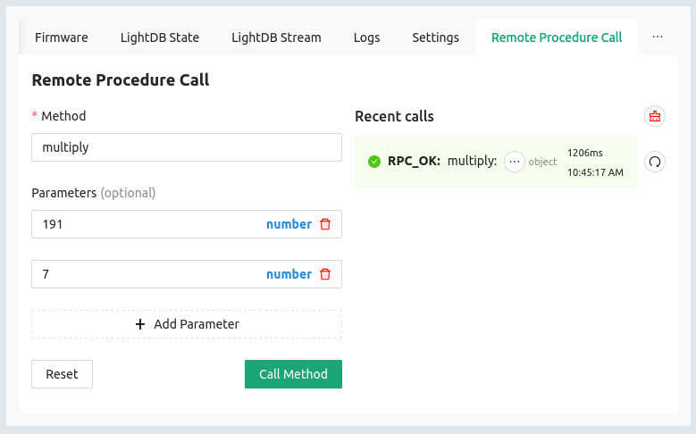
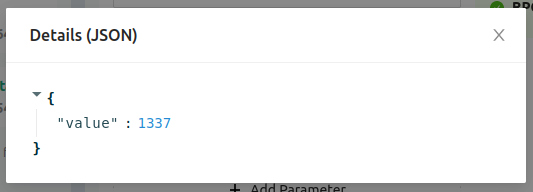

The Golioth Remote Procedure Call (RPC) allows a server-side command to execute
a function on the remote device, including supplying input parameters and
receiving output data from the function. RPC is handy for things like executing
a device reset, or running a function with input that was not available at
compile time.

## Includes

```c
#include <net/golioth/system_client.h>
#include <net/golioth/rpc.h>
#include <qcbor/qcbor.h>
#include <qcbor/qcbor_spiffy_decode.h>
```

Including the Golioth System Client, RPC, and QCbor header files makes
the Golioth API and helper functions available to your program.

### Registering a callback

```c
static void golioth_on_connect(struct golioth_client *client)
{
	int err = golioth_rpc_register(client, "multiply", on_multiply, NULL);

	if (err) {
		LOG_ERR("Failed to register RPC: %d", err);
	}
}
```

Use the `golioth_rpc_register()` function to register a callback that will
execute asynchronously when an RPC request is received from the Golioth Cloud.
Required parameters are the Golioth Client object, the method name (as a
string), the name of the callback function, and an optional user-defined
parameter.

:::tip Register RPC callbacks whenever connected

We recommend that this callback be registered in the `client->on_connect`
callback that runs each time the device connects to Golioth. This way, the
device will register the RPC at every reconnect.

:::

### Callback function

```c
static enum golioth_rpc_status on_multiply(QCBORDecodeContext *request_params_array,
					   QCBOREncodeContext *response_detail_map,
					   void *callback_arg)
{
	double a, b;
	double value;
	QCBORError qerr;

	QCBORDecode_GetDouble(request_params_array, &a);
	QCBORDecode_GetDouble(request_params_array, &b);
	qerr = QCBORDecode_GetError(request_params_array);
	if (qerr != QCBOR_SUCCESS) {
		LOG_ERR("Failed to decode array items: %d (%s)", qerr, qcbor_err_to_str(qerr));
		return GOLIOTH_RPC_INVALID_ARGUMENT;
	}

	value = a * b;
	QCBOREncode_AddDoubleToMap(response_detail_map, "value", value);
	return GOLIOTH_RPC_OK;
}
```

Golioth uses [CBOR](http://cbor.io/) serialization to transfer RPC information
between the device and the server. This conserves bandwidth and radio-on time
(battery) by keeping the data transfer as small as possible.

If input parameters were included in the RPC message they can be extracted from
the `request_params_array` object. Any return values should be encoded in the
`response_detail_map`.

The callback is responsible for returning the `GOLIOTH_RPC_OK` status message to
the Golioth servers indicating that the RPC was successful, or an error status
indicating why it was not. There are a number of different error status messages
that can be returned. View the `golioth_rpc_status` enumeration [in the Golioth
Zephyr SDK
reference](https://zephyr-sdk-docs.golioth.io/group__golioth__rpc.html) for more
information.

## Summary



Once the firmware is running, an RPC request can be sent from the device-level
"Remote Procedure Call" tab in [the Golioth Console](https://console.golioth.io)
(shown above) or via a call to our REST API.



The status of the RPC request is shown in the same tab. The response can be
viewed by clicking the three-dot button in the "Recent calls" list.

The best example of Remote Procedure Call is found in [the RPC sample
code](https://github.com/golioth/golioth-zephyr-sdk/tree/main/samples/rpc).

Further documentation of the device SDK is available in the [Golioth Zephyr SDK
Reference](https://zephyr-sdk-docs.golioth.io/) (Doxygen).
