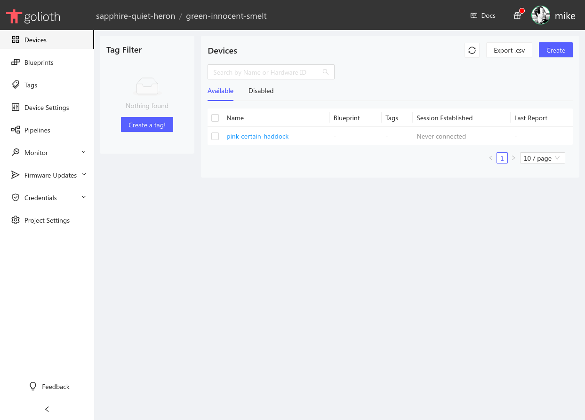

Let's use the Golioth Console to create a new device.

In the center at the top of the console widow the currently selected project is shown. On the left sidebar we can use the Management&rarr;Devices option to list this project's devices. Here we see the device that was created by the quickstart wizard.

* Click the Create button in the upper right to create a new device.

    

* Enter a Name and click save to create the device.

:::note
There are three optional values that we are not setting for this example

* **Tags:** Group different types of devices together with your project
* **Blueprints:** A designator used to identify device types for Over-the-Air updates (OTA)
* **Hardware ID:** A unique hardware ID that you can choose to set to meet your project's needs (MAC address, serial number, etc.)
:::

Before your newly created device can communicate with the Golioth Cloud it will need to be assigned credentials using the device authorization process.