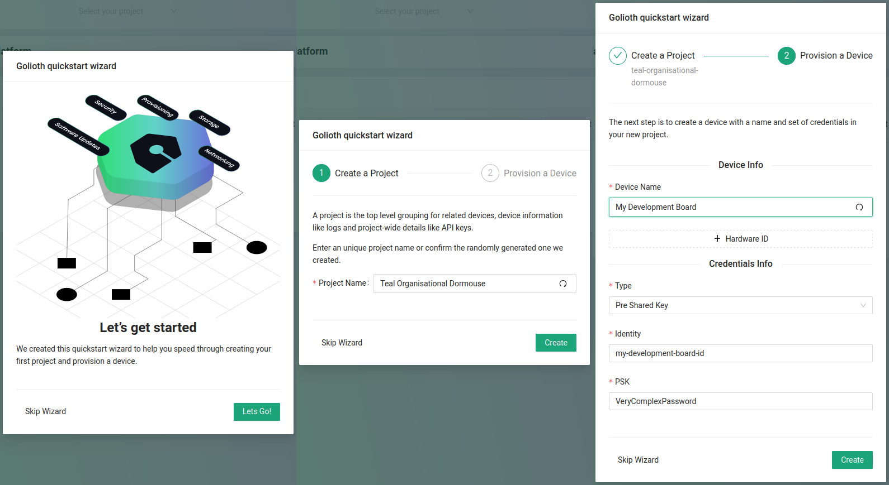

To begin using Golioth please register for an account at [console.golioth.io](https://console.golioth.io/).

import Image from '@theme/IdealImage';
import FlexImage from '@site/src/components/FlexImage';
import GoliothConsoleOnboarding from '../assets/console-onboarding.jpg';
import GoliothConsoleEmpty from '../assets/console-click-quickstart.jpg';
import GoliothConsoleQuickstart from '../assets/console-quickstart-lets-go.jpg';

<FlexImage column_count="3">
  <Image img={GoliothConsoleOnboarding} alt="Golioth console without a project"/>
  <Image img={GoliothConsoleEmpty} alt="Golioth console without a project"/>
  <Image img={GoliothConsoleQuickstart} alt="Golioth console quickstart launch screen"/>
</FlexImage>

Once registered, you can review our terms of service and continue to the wizard that guides you through provisioning your first device.

### Step 1: Project name

* Enter a Project Name of your choosing

### Step 2: Device name

* Enter a human-readable Device Name

### Step 3: Device credentials

* The Identity of this device is automatically populated from the device name with `-id` and `@project-name` appended
* A Pre-Shared Key (PSK) is automatically generated. This is a password that will authenticate this device to the Golioth Cloud

It really is that simple, you have provisioned your first device! Let's provision a second device to get to know the console just a bit better.
