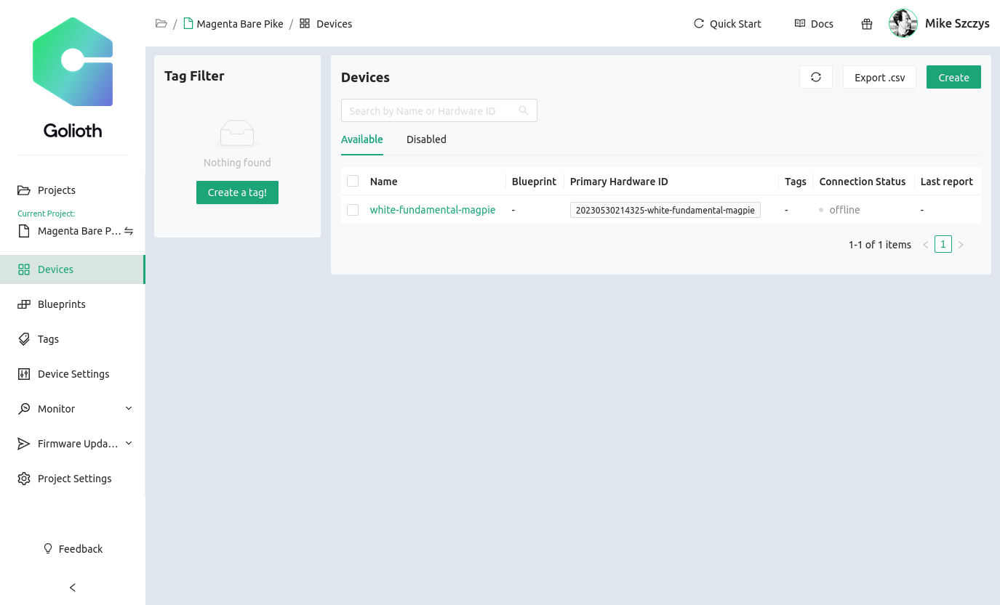
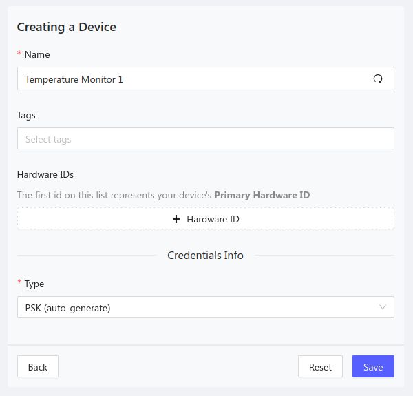
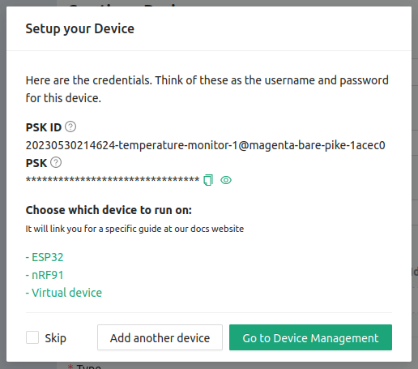

Let's use the Golioth Console to create a new device.

In the center at the top of the console widow the currently selected project is
shown. On the left sidebar we can use the Devices option to list this project's
devices. Here we see the device that was created by the quickstart wizard.

## Create a new device

Click the Create button in the upper right to create a new device.

### 1. Device name

Enter a name for your device

### 2. Tags, Blueprints, and hardware ID

There are three optional values that we are not setting for this example

* **Tags:** Group different types of devices together with your project
* **Blueprints:** A designator used to identify device types for Over-the-Air
  updates (OTA)
* **Hardware ID:** A unique hardware ID that you can choose to set to meet your
  project's needs (MAC address, serial number, etc.)

### 3. Generate Credentials

By default, a PSK-ID and PSK will be automatically generated for this device.
If you wish to set these manually, you may choose that option from the dropdown
menu.

## New device summary

After clicking save, your device is created and a new device summary is displayed.

Click the Go to Device Management button and continue to the next page of this
guide.
