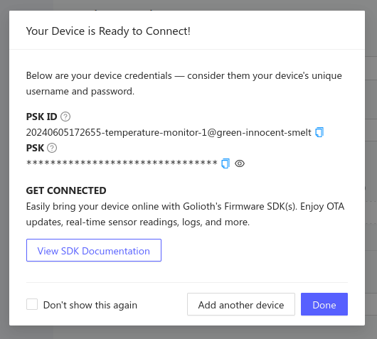

Let's use the Golioth Console to create a new device.

In the center at the top of the console window the currently selected project is
shown. On the left sidebar we can use the Devices option to list this project's
devices. Here we see the device that was created by the quickstart wizard.

## Create a new device

Click the Create button in the upper right to create a new device.

### 1. Device name

Enter a name for your device

### 2. Tags, Blueprints, and hardware ID

There are three optional values that we are not setting for this example

* **Tags:** Group different types of devices together with your project
* **Blueprints:** A designator used to identify device types for Over-the-Air
  updates (OTA)
* **Hardware ID:** A unique hardware ID that you can choose to set to meet your
  project's needs (MAC address, serial number, etc.)

### 3. Generate Credentials

By default, a PSK-ID and PSK will be automatically generated for this device.
If you wish to set these manually, you may choose that option from the dropdown
menu.

## New device summary

After clicking save, your device is created and a new device summary is displayed.

## Retrieving Device Credentials

To access device credentials, select the Credentials tab from the device view
in the Golioth Console. The PSK-ID and PSK (the Identity and the Pre Shared
Key) are what your device needs to authenticate and connect to the Golioth
Cloud. You can always return to this panel in the device details to retrieve
these values.

:::tip Golioth Supports Certificate Authentication
When getting to know Golioth, Pre-Shared Key (PSK) authentication is
demonstrated as a happy path to get a demo device running right away. However,
Golioth supports and recommends using X509 certificate (ECDSA) for your
production devices.

<!-- Use full URL here because this page gets imported to the Developer Training
repo and we want the URL to work over there too -->
* Firmware Section: [Certificate
  Authentication](https://docs.golioth.io/firmware/golioth-firmware-sdk/authentication/certificate-auth)
:::

Congratulations, you're ready to move on to selecting hardware!
