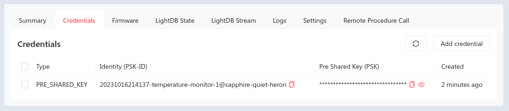

To connect to the Golioth Cloud, we need to create credentials for the newly created device.

Open the device details screen by first selecting the Management&rarr;Devices option from the left sidebar. This will bring up a list of all of your devices. In the Action column, click the sliders icon for your device.

### Adding Device Credentials

* Click the Create button in the Credentials section.

    

* The identity of this device can be auto-generated from the device name so leave this empty
* Golioth will automatically assign a random PSK, or you can choose your own
* Click Save to go back to the device details screen

### Retrieving Device Credentials

The credentials have been added to this device. These two values (the Identity and the Pre Shared Key) are what your device needs to authenticate and connect to the Golioth Cloud. You can always return to this panel in the device details to retrieve these values.

:::note
When a device credential ID is automatically assigned it follows this format: GMT timestamp, the name of the device, and the name of the project. If you prefer shorter device IDs, you may want to choose the ID yourself. By convention, all device credential IDs will end with the `@` symbol followed by the project name.
:::

Congratulations, you're ready to move on to selecting hardware!
