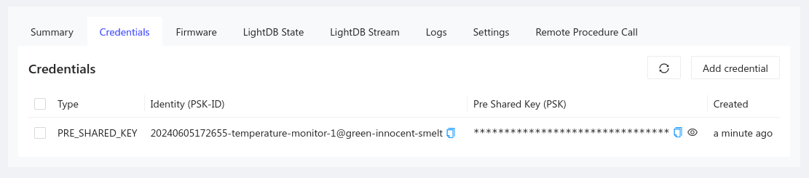

To connect to the Golioth Cloud, we need to pass the newly created credentials
to the hardware device.

### Retrieving Device Credentials

To access device credentials, select the Credentials tab from the device view
in the Golioth Console. The PSK-ID and PSK (the Identity and the Pre Shared
Key) are what your device needs to authenticate and connect to the Golioth
Cloud. You can always return to this panel in the device details to retrieve
these values.

:::note
When a device credential ID is automatically assigned it follows this
format: GMT timestamp, the name of the device, and the name of the project. If
you prefer shorter device IDs, you may want to choose the ID yourself. By
convention, all device credential IDs will end with the `@` symbol followed by
the project name.
:::

Congratulations, you're ready to move on to selecting hardware!
