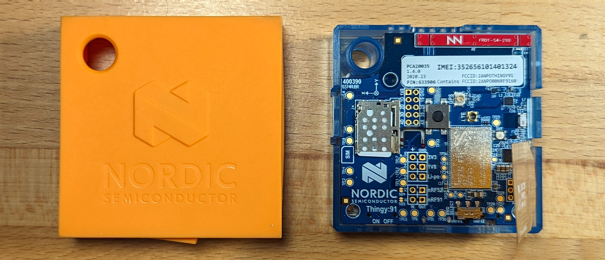
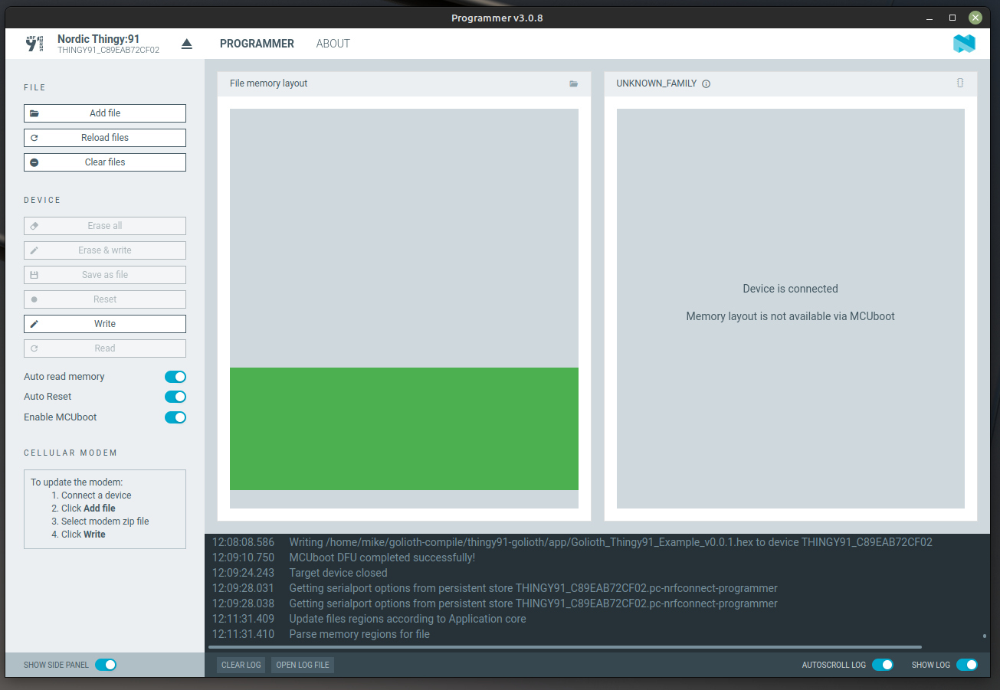
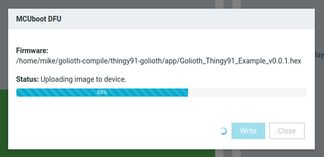

# Thingy:91 Test Application



You can test out Golioth services using the [Golioth Thingy91 Example
Program](https://github.com/golioth/thingy91-golioth/) for the [Nordic
Thingy:91](https://www.nordicsemi.com/Products/Development-hardware/Nordic-Thingy-91).
This nRF9160-based cellular device includes an accelerometer, light sensor, RGB
LED, user button, a speaker&mdash;all of which are used in this demo.

The following Golioth Services are demonstrated by this application:

* Device Status
* OTA Firmware Update
* LightDB State (bi-directional data transfer)
* LightDB Stream (time-series device-to-cloud data transfer)
* Remote Logging
* Remote Procedure Call

## Section Overview

**Prerequisite:** You must have an active SIM card installed in your Thingy91 to
continue with this section.

1. Install nRF Connect for Desktop to program the firmware to your Thingy91
2. Download and program the precompiled firmware binary
3. Add device credentials and connect to Golioth
4. Test drive Golioth!

## 1. Install nRF Connect for Desktop

To program binaries to the Thingy91 we recommend starting with the [Nordic nRF
Connect for
Desktop](https://infocenter.nordicsemi.com/index.jsp?topic=/struct_nrftools/struct/nrftools_nrfconnect.html)
tools as they have great cross-platform support and work well.

import InstallNrfConnect from './\_partials/install_nrf_connect.md'


<details>
  <summary>Show me how to install nRF Connect for Desktop</summary>

<InstallNrfConnect/>

</details>

## 2. Download and program the precompiled firmware binary

1. Go to [the latest
   release](https://github.com/golioth/thingy91-golioth/releases/latest) and
   download `Thingy91_Golioth_Example_vX.X.X.hex`
2. Flash the precompiled binary to the Thingy:91
    1. Remove the orange rubber case from your Thingy:91
    2. Plug a USB cable into your computer and into the Thingy:91
    3. **Place the Thingy:91 in bootloader mode:** With the Thingy:91 power
       switch in the off position, hold the black button in the middle of the
       board and turn the power switch on
    4. In the nRF Connect Desktop Programmer, choose `Nordic Thingy:91` from the
       upper left `SELECT DEVICE` dialog.
    5. Click Add file and choose the `Thingy91_Golioth_Example_vX.X.X.hex` file
       you previously downloaded
    6. Click the `Write` button


<details>
  <summary>Show me screenshots of the programming process</summary>

Adding the firmware binary in nRF Connect for Desktop programming tool:



The MCUboot progress screen indicating a successful programming process:


</details>

## 3. Add device credentials and connect to Golioth

Golioth Device Credentials must be added to the device for it to connect
properly. This is accomplished over USB using the Shell built into Zephyr.

1. Launch nRF Connect for Desktop. From that application, install and open the
   Serial Terminal.

2. Connect the Serial Terminal to your device

    1. Plug a USB cable into your computer and your Thingy:91
    2. Place the Thingy:91 power switch in the `On` position
    3. Choose `Nordic Thingy:91` from the upper left `SELECT DEVICE` dialog
    4. Select the first of two available serial ports
    5. Click `Connect to Port`

    You can now turn the Thingy:91 power switch off and back on to see the serial
    output as it runs. We expect that the device will not be able to connect as
    it does not yet have credentials.

    

3. Use the serial connection to assign Golioth Device Credentials

    :::info Where do I find device credentials?

    Golioth Device Credentials were created during the [Golioth Web
    Console Registration & Wizard](/getting-started/console/register) step. You
    can return to the [Golioth Console](https://console.golioth.io/) to retrieve
    the PSK-ID/PSK.

    :::

    Use the following command syntax to assign your credentials. Type each line
    one at a time into the serial terminal, replacing the placeholder
    credentials with your own.

    ```
    uart:~$ settings set golioth/psk-id "<my-psk-id@my-project>"
    uart:~$ settings set golioth/psk "<my-psk>"
    uart:~$ kernel reboot cold
    ```

4. Observe the device connecting to Golioth

    After the Thingy:91 reboots, the serial terminal will remain connected. You
    should see the device connect to LTE, then Golioth, and begin streaming
    data:

    ```
    [00:00:01.483,825] <inf> golioth_system: Initializing
    [00:00:01.486,450] <inf> BH1749: BH1749 initialized
    [00:00:01.491,546] <inf> fs_nvs: 2 Sectors of 4096 bytes
    [00:00:01.491,546] <inf> fs_nvs: alloc wra: 0, fa0
    [00:00:01.491,577] <inf> fs_nvs: data wra: 0, b0
    [00:00:01.493,041] <dbg> thingy91_golioth: main: Start Reference Design Template sample
    [00:00:01.493,072] <inf> thingy91_golioth: Firmware version: 0.0.0+0
    [00:00:01.493,164] <err> i2c_nrfx_twim: Error 0x0BAE0001 occurred for message 0
    [00:00:01.493,255] <inf> golioth_samples: Waiting for interface to be up
    [00:00:01.493,286] <inf> thingy91_golioth: Connecting to LTE network. This may take a few minutes...
    [00:00:01.548,065] <dbg> app_work: buzzer_thread: golioth
    [00:00:01.548,126] <err> BH1749: No valid data to fetch.
    [00:00:01.548,126] <err> app_work: sensor_sample_fetch failed err -5
    [00:00:15.824,218] <inf> thingy91_golioth: Connected to LTE network
    [00:00:15.824,371] <inf> golioth_system: Starting connect
    [00:00:17.927,947] <inf> thingy91_golioth: Registering observations with Golioth
    [00:00:17.931,030] <dbg> app_settings: app_led_pwm_init: turning on pwm leds
    [00:00:17.931,060] <inf> golioth_system: Client connected!
    ```

:::tip Don't forget the SIM card

Your Thingy:91 is a celluar device and must have an activated SIM card inserted
in order to connect to the internet (and Golioth)

:::

## 4. Test drive Golioth!

### Video Walkthrough

The features of the Golioth Thingy91 Example Application are demonstrated in the
following video.

<iframe class="youtube-embed" src="https://www.youtube.com/embed/JVwrYfboO18?si=DsLU94gdC143gN_x" title="YouTube video player" frameborder="0" allow="accelerometer; autoplay; clipboard-write; encrypted-media; gyroscope; picture-in-picture; web-share" allowfullscreen></iframe>

### Features and Services

When the app connects to Golioth, the connection status will immediately be
updated, along with the firmware version. You can visit the [Golioth
Console](https://console.golioth.io) page to view information for this device.


* Pressing the button on the device will increment the counters in the LightDB
  State tab.
* Sensor data is regularly streamed into the LightDB Stream tab
* Remote logs may be viewed in the Logs tab.
* Device settings are updated in the Settings tab. Try using the left sidebar to
  add a project-level setting called `LOOP_DELAY_S` and set it to `15` to change
  the frequency of sensor readings to 15 seconds.
* Issue a remote procedure call (RPC) in the Remote Procedure Call tab, using
  `play_song` for the method with `funkytown` as a parameter.
* The Firmware tab displays last reported firmware version and status.
    * The release page where you downloaded the `.hex` file also includes two
      `.bin` files which may be used to roll out (and roll back) over-the-air
      (OTA) firmware updates.
    * Use the Firmware Update section of the left sidebar to control OTA
      updates.
