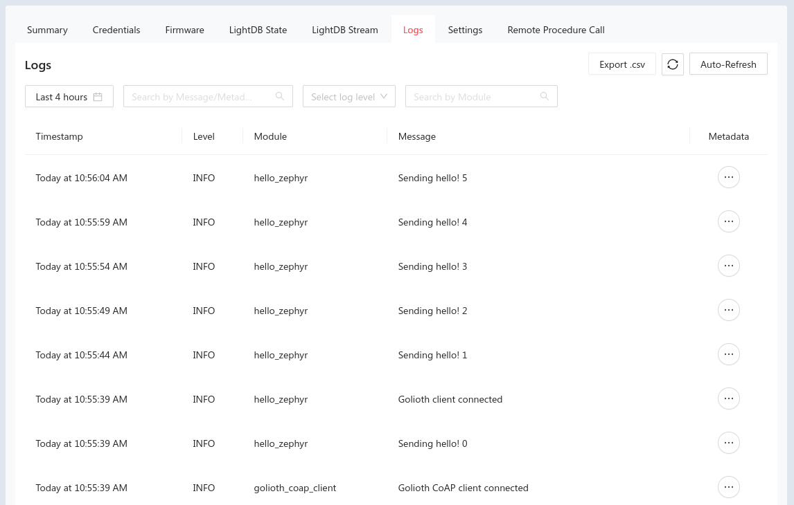

import Tabs from '@theme/Tabs';
import TabItem from '@theme/TabItem';

The Golioth Firmware SDK includes [a number of Zephyr example
applications](https://github.com/golioth/golioth-firmware-sdk/tree/main/examples/zephyr)
to demonstrate each of our services. In this section we'll build the `hello`
sample which connects to Golioth and sends "Hello Golioth! n" messages to our
remote logging service.

This same configure&rarr;build&rarr;flash process may be applied to all of the
other Golioth Zephyr example apps.

## Hardware choices

These examples can be built for any hardware supported by Zephyr. However, each
will need some device-specific configuration. Golioth maintains configurations
for a range of development boards as part of our continuous integration (CI).

* [Nordic nRF52840
  DK](https://www.nordicsemi.com/Products/Development-hardware/nRF52840-DK)
  using an ESP32 as an AT modem
  ([details](https://github.com/golioth/golioth-firmware-sdk/tree/main/examples/zephyr/hello#nrf52840-dk--esp32-wroom-32))
* [NXP i.MX 1024 Evaluation
  Kit](https://www.nxp.com/design/design-center/development-boards/i-mx-evaluation-and-development-boards/i-mx-rt1024-evaluation-kit:MIMXRT1024-EVK)
* [ESP32 DevKitC
  WROVER](https://www.espressif.com/en/products/devkits/esp32-devkitc)
* [RAK5010 WisTrio NB-IoT Tracker Pro (Quectel
  BG95-M3)](https://docs.rakwireless.com/Product-Categories/WisTrio/RAK5010)

This page includes build commands for these boards. You may model configuration
for your own target hardware on the configuration and overlay files found in the
`boards` directory of each example application.

## Build the `hello` code example

Navigate to the workspace installed in the previous section to ensure your
virtual environment is activated before moving to the Golioth Firmware SDK
folder:

<Tabs
groupId="os"
defaultValue="linux"
values={[
{label: 'Linux', value: 'linux'},
{label: 'MacOS', value: 'macos'},
{label: 'Windows', value: 'windows'},
]}>

<TabItem value="linux">

```console
cd ~/golioth-zephyr-workspace
source .venv/bin/activate
cd modules/lib/golioth-firmware-sdk
```

</TabItem>

<TabItem value="macos">

```console
cd ~/golioth-zephyr-workspace
source .venv/bin/activate
cd modules/lib/golioth-firmware-sdk
```

</TabItem>

<TabItem value="windows">

```console
cd c:\golioth-zephyr-workspace
.venv\Scripts\activate.bat
cd modules\lib\golioth-firmware-sdk
```

</TabItem>
</Tabs>

### Build the firmware and flashing the device

<Tabs
groupId="os"
defaultValue="nrf52840"
values={[
{label: 'Nordic nRF52840', value: 'nrf52840'},
{label: 'NXP RT1024', value: 'rt1024'},
{label: 'ESP32', value: 'esp32'},
{label: 'RAK5010', value: 'rak5010'},
]}>

<TabItem value="nrf52840">

```console
west build -b nrf52840dk/nrf52840 examples/zephyr/hello
west flash
```
</TabItem>

<TabItem value="rt1024">

```console
west build -b mimxrt1024_evk examples/zephyr/hello
west flash
```
</TabItem>

<TabItem value="esp32">

```console
west build -b esp32_devkitc_wrover/esp32/procpu examples/zephyr/hello
west flash
```
</TabItem>

<TabItem value="rak5010">

:::tip RAK5010 Requires an External Programmer

You will need an external programmer to flash the RAK5010. There are many
options, including J-Link, BlackMagic Probe, and using the offboard debug header
on an nRF9160dk.

For this example [we've connected a J-Link
programmer](https://docs.rakwireless.com/Product-Categories/WisTrio/RAK5010/Quickstart/#through-j-link-rtt-viewer).

:::

```console
west build -b rak5010 examples/zephyr/hello
west flash -r jlink
```
</TabItem>
</Tabs>

### Setting Credentials

You must set Golioth credentials (and if necessary, WiFi credentials) for the
example to authenticate with Golioth. The SDK samples store credentials in the
Zephyr Settings subsystem, and these can be set through the shell:

```console
uart:~$ settings set golioth/psk-id <YOUR-PSK-ID>
uart:~$ settings set golioth/psk <YOUR-PSK>
uart:~$ settings set wifi/ssid <YOUR-WIFI-SSID>
uart:~$ settings set wifi/psk <YOUR-WIFI-PASSWORD>
```

<details>
  <summary>How to find credentials</summary>


* Golioth credentials are available in the `Credentials` tab for your device
    * Open the Golioth Console
    * Select `Devices` on  the left sidebar and choose your device from the
      resulting list
    * Click on the `Credentials` tab and copy your `PSK-ID` and `PSK`
* If your device connects via WiFi, you will need the `SSID` and `PSK` of your
  wireless access point.
</details>

### Example Output

View output from your device by opening a serial terminal (115200 8N1). The
result should be a successful connection to Golioth.

```console
*** Booting Zephyr OS build zephyr-v3.4.0-553-g40d224022608 ***
[00:00:00.020,000] <inf> net_config: Initializing network
[00:00:00.020,000] <inf> net_config: IPv4 address: 192.0.2.1
[00:00:00.020,000] <dbg> hello_zephyr: main: start hello sample
[00:00:00.020,000] <inf> golioth_samples: Waiting for interface to be up
[00:00:00.020,000] <inf> golioth_mbox: Mbox created, bufsize: 1100, num_items: 10, item_size: 100
[00:00:00.070,000] <inf> golioth_coap_client: Start CoAP session with host: coaps://coap.golioth.io
[00:00:00.070,000] <inf> golioth_coap_client: Session PSK-ID: your-device-id@your-golioth-project
[00:00:00.070,000] <inf> golioth_coap_client: Entering CoAP I/O loop
[00:00:01.260,000] <inf> golioth_coap_client: Golioth CoAP client connected
[00:00:01.260,000] <inf> hello_zephyr: Sending hello! 0
[00:00:01.260,000] <inf> hello_zephyr: Golioth client connected
[00:00:06.270,000] <inf> hello_zephyr: Sending hello! 1
[00:00:11.280,000] <inf> hello_zephyr: Sending hello! 2
```

You can confirm this connection by viewing the Status section of the summary
page for your device in the Golioth web console. You will also see the hello
messages listed in the Log tab:



## Additional Golioth Example Code

Congratulations on running the Hello app! The same process may be used to run
[other Golioth example
applications](https://github.com/golioth/golioth-firmware-sdk/tree/main/examples/zephyr).
Be sure to reference the README file for each for detailed configuration and
usage information.

* **certificate_provisioning:** Use certificate authentication
* **firmware_update:** Use Golioth over-the-air (OTA) firmware update
* **hello:** Connect and send hello logging messages
* **lightdb:** Set, get, and observe stateful data between device and cloud
* **lightdb_stream:** Send time-series data from device to cloud
* **logging:** Demonstrate logging messages of each different log level
* **rpc:** Issue a remote procedure call (rpc) and received data back from device
* **settings:** Demonstrate fleet-wide device settings service
