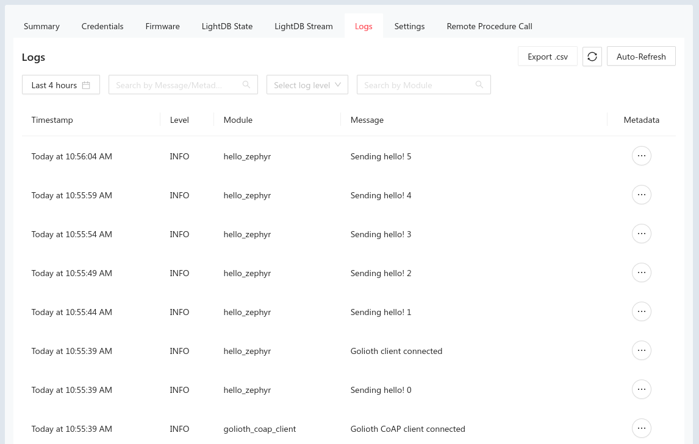

import Tabs from '@theme/Tabs';
import TabItem from '@theme/TabItem';

The Golioth Firmware SDK includes [a number of Zephyr example
applications](https://github.com/golioth/golioth-firmware-sdk/tree/main/examples/zephyr)
to demonstrate each of our services. In this section we'll build the `hello`
sample which connects to Golioth and sends "Hello Golioth! n" messages to our
remote logging service.

This same configure&rarr;build&rarr;flash process may be applied to all of the
other Golioth Zephyr example apps.

## Hardware choices

These examples can be built for any hardware supported by Zephyr. However, each
will need some device-specific configuration. Golioth maintains an NCS
configuration for the [Nordic nRF9160
DK](https://www.nordicsemi.com/Products/Development-hardware/nrf9160-dk)
cellular development board as part of our continuous integration (CI).

This page includes build commands for this board. You may model configuration
for your own target hardware on the configuration and overlay files found in the
`boards` directory of each example application.

## Build the `hello` code example

Navigate to the workspace installed in the previous section to ensure your
virtual environment is activated before moving to the Golioth Firmware SDK
folder:

<Tabs
groupId="os"
defaultValue="linux"
values={[
{label: 'Linux', value: 'linux'},
{label: 'MacOS', value: 'macos'},
{label: 'Windows', value: 'windows'},
]}>

<TabItem value="linux">

```console
cd ~/golioth-ncs-workspace
source .venv/bin/activate
cd modules/lib/golioth-firmware-sdk
```

</TabItem>

<TabItem value="macos">

```console
cd ~/golioth-ncs-workspace
source .venv/bin/activate
cd modules/lib/golioth-firmware-sdk
```

</TabItem>

<TabItem value="windows">

```console
cd c:\golioth-ncs-workspace
.venv\Scripts\activate.bat
cd modules\lib\golioth-firmware-sdk
```

</TabItem>
</Tabs>

### Use hardcoded credentials

Edit the `examples/zephyr/hello/prj.conf` file. Add the following lines,
replacing the placeholder text with your credentials:

```config title="examples/zephyr/hello/prj.conf"
CONFIG_GOLIOTH_SAMPLE_PSK_ID="my-psk-id"
CONFIG_GOLIOTH_SAMPLE_PSK="my-psk"
```

<details>
  <summary>How to find credentials</summary>

You must set Golioth credentials for the example to authenticate with Golioth.
For these granular examples we will use hardcoded credentials.


* Golioth credentials are available in the `Credentials` tab for your device
    * Open the Golioth Console
    * Select `Devices` on  the left sidebar and choose your device from the
      resulting list
    * Click on the `Credentials` tab and copy your `PSK-ID` and `PSK`
</details>


:::info Not recommended for production

We use hardcoded credentials for this example because they are the easiest to
set up quickly. However, in production you should plan to use certificate
authentication and store credentials outside of the firmware binary itself.

:::

### Build the firmware and flashing the device

```console
west build -b nrf9160dk_nrf9160_ns examples/zephyr/hello
west flash
```

### Example Output

View output from your device by opening a serial terminal (115200 8N1). The
result should be a successful connection to Golioth.

```console
*** Booting nRF Connect SDK v2.5.0 ***
[00:00:00.459,167] <dbg> hello_zephyr: main: start hello sample
[00:00:00.459,197] <inf> golioth_samples: Waiting to obtain IP address
[00:00:01.502,960] <inf> lte_monitor: Network: Searching
[00:00:01.570,312] <inf> lte_monitor: RRC: Connected
[00:00:04.557,617] <inf> lte_monitor: Network: Registered (roaming)
[00:00:04.558,593] <inf> golioth_mbox: Mbox created, bufsize: 1144, num_items: 10, item_size: 104
[00:00:04.866,027] <inf> golioth_coap_client: Start CoAP session with host: coaps://coap.golioth.io
[00:00:04.866,058] <inf> golioth_coap_client: Session PSK-ID: devboard-one-id@ttgo-demo
[00:00:04.867,492] <inf> golioth_coap_client: Entering CoAP I/O loop
[00:00:07.450,653] <inf> golioth_coap_client: Golioth CoAP client connected
[00:00:07.450,866] <inf> hello_zephyr: Sending hello! 0
[00:00:07.450,897] <inf> hello_zephyr: Golioth client connected
[00:00:12.450,927] <inf> hello_zephyr: Sending hello! 1
[00:00:13.819,091] <inf> lte_monitor: RRC: Idle
[00:00:13.955,017] <inf> lte_monitor: RRC: Connected
[00:00:17.451,049] <inf> hello_zephyr: Sending hello! 2
[00:00:19.182,403] <inf> lte_monitor: RRC: Idle
[00:00:19.315,307] <inf> lte_monitor: RRC: Connected
[00:00:22.451,171] <inf> hello_zephyr: Sending hello! 3
```

You can confirm this connection by viewing the Status section of the summary
page for your device in the Golioth web console. You will also see the hello
messages listed in the Log tab:



## Additional Golioth Example Code

Congratulations on running the Hello app! The same process may be used to run
[other Golioth example
applications](https://github.com/golioth/golioth-firmware-sdk/tree/main/examples/zephyr).
Be sure to reference the README file for each for detailed configuration and
usage information.

* **certificate_provisioning:** Use certificate authentication
* **firmware_update:** Use Golioth over-the-air (OTA) firmware update
* **hello:** Connect and send hello logging messages
* **lightdb:** Set, get, and observe stateful data between device and cloud
* **lightdb_stream:** Send time-series data from device to cloud
* **logging:** Demonstrate logging messages of each different log level
* **rpc:** Issue a remote procedure call (rpc) and received data back from device
* **settings:** Demonstrate fleet-wide device settings service
