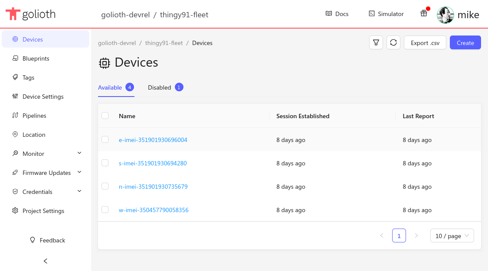

## What is Golioth?

Golioth is an IoT platform optimized for the developer experience. We provide a
single control plane for all of your devices.

### Cloud Side

From over-the-air (OTA) firmare updates, to remote procedure calls (RPC) and
device fleet settings, to device-to-cloud time series data and bidirectional
state data, we've already built the management tools you need. Our data-routing
features ensure your data can go where you need it, whether that's AWS, Azure,
GCP, or any other server, app, or database platform.

### Device Side

You choose your own embedded hardware and firmware platform. Golioth already
provides SDKs for Zephyr, ESP-IDF, and ModusToolbox&trade;. For other platforms,
we have a [porting
guide](https://github.com/golioth/golioth-firmware-sdk/blob/main/docs/Porting_Guide.md)
and can offer guidance in that process.

## Let's get Started!

The getting started guide will prepare your Golioth account to communicate
directly with your hardware devices, and guide you through flashing demo
applications onto your hardware so you can begin testing Golioth services right
away.

In this section:

* Open your Golioth account and create your first device.
* Flash a pre-compiled binary or build some sample app firmware from source.
* See your device connect to Golioth, send and receive data, and control this
  mighty mini-fleet from the cloud.
