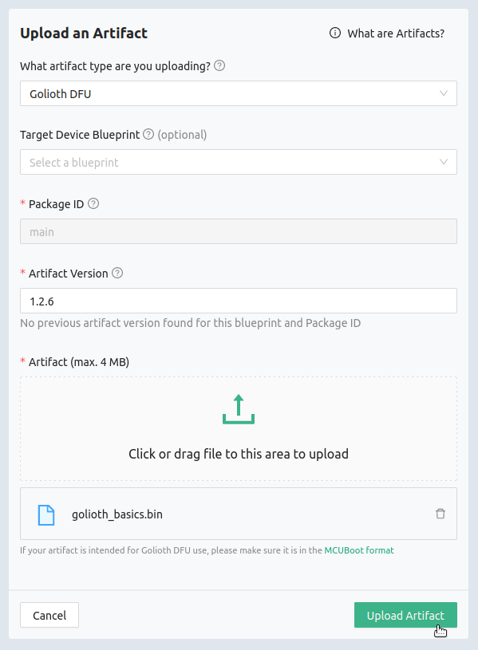
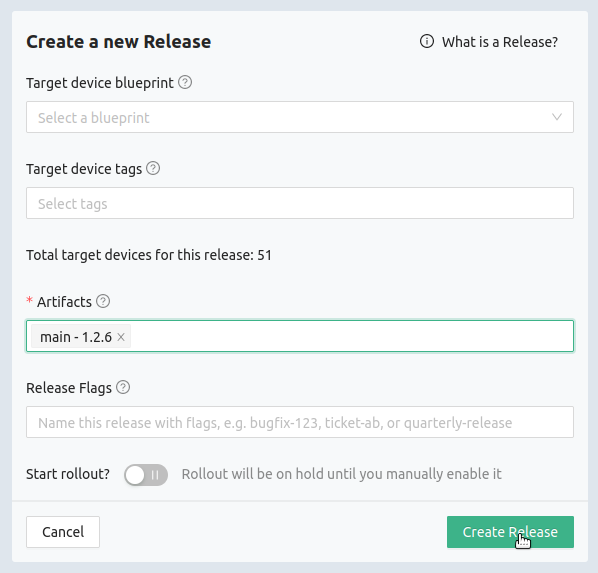
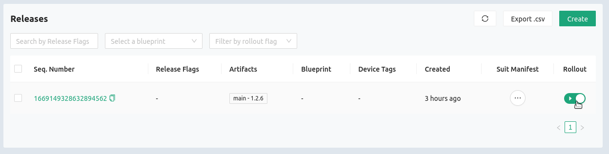
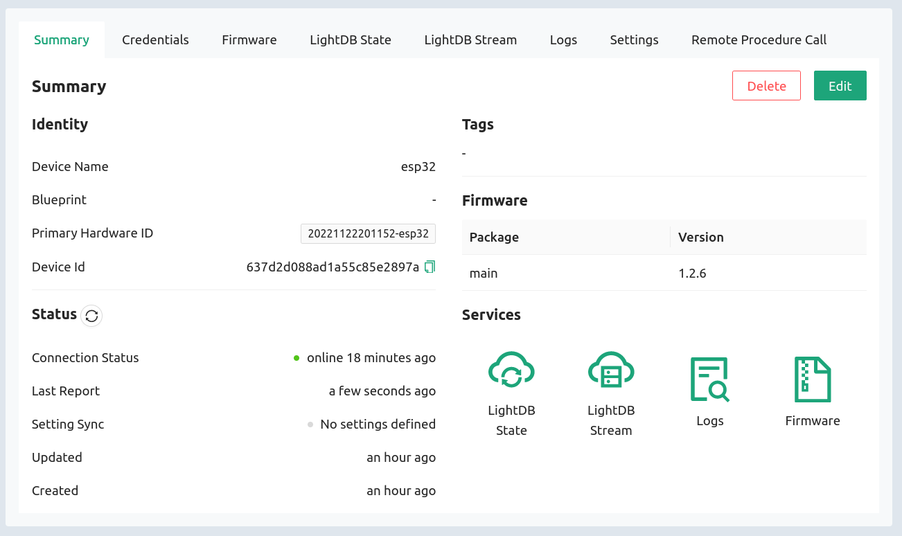

The most sought after Golioth feature is Over-the-Air firmware update (OTA). The
ability to update firmware is crucial to building a robust and reliable IoT
fleet. This is built into the Golioth SDK and the `golioth_basics` sample we
ran on the previous page includes this feature. Let's try it out!

## Overview

On this page we'll cover two steps to completing an OTA update:

* Change the version number in the sourcecode and build the binary
* Upload the binary to Golioth and roll it out to the device(s)

## Update version number and build firmware

The `golioth_basics` sample uses a common file located at
`golioth-firmware-sdk/examples/common/golioth_basics.c`. Edit this file,
updating the version number to `1.2.6`. For fun, also change the tag name to
`golioth_basics_new` just so it's easy to see from the logging messages that a
new firmware version is running.

```c title="changes to: golioth-firmware-sdk/examples/common/golioth_basics.c"
#define TAG "golioth_basics_new"

// Current firmware version
static const char* _current_version = "1.2.6";
```

Now return to the `golioth-firmware-sdk/examples/esp_idf/golioth_basics` folder
and rebuild the example.

```shell
idf.py build
```

:::tip Don't flash the ESP32!

Remember, do not use the `idf.py flash` command this time. We will be uploading
the new binary to the device over WiFi.

:::

After running the build command, your new binary will be located at
`build/golioth_basics.bin`.

## Upload the binary to Golioth and rollout a release

### 1. Create an Artifact

On the Golioth Console, go to **Firmware Update&rarr;Artifacts** on the left
sidebar and click the Create button.



* Set the **Artifact Version to 1.2.6** (to match what was compiled into the
  firmware)
* Click the upload button in the middle of the window and choose your
  `golioth_basics.bin` file.
* Click the **Upload Artifact** button to finish creating an artifact.

### 2. Create a Release

On the Golioth Console, go to **Firmware Update&rarr;Releases** on the left
sidebar and click the Create button.



* Select our newly created artifact (`main-1.2.6`) from the **Artifacts** box.
* Click the **Create Release** button to finish creating the release.

### 3. Rollout the Release

On the Golioth Console, go to **Firmware Update&rarr;Releases** on the left
sidebar and you will see an entry for our newly created release which is based
on the `main-1.2.6` artifact.



* Click the toggle button in the **Rollout** column.
* In the confirmation window, click on **Toggle** to rollout this firmware
  release.

## Observe the OTA firmware update

In the terminal window you see the ESP32 almost immediately recognizes that new
firmware is available:

```shell
I (175827) golioth_basics: Sending hello! 17
I (185007) golioth_fw_update: Received OTA manifest
I (185007) golioth_fw_update: Current version = 1.2.5, Target version = 1.2.6
I (185017) golioth_fw_update: State = Downloading
I (185317) golioth_fw_update: Image size = 1211744
I (185327) golioth_fw_update: Getting block index 0 (1/1184)
I (185827) golioth_basics: Sending hello! 18
W (187867) golioth_coap_client: CoAP message retransmitted
I (187947) fw_update_esp_idf: Writing to partition subtype 17 at offset 0x1a0000
I (187947) fw_update_esp_idf: Erasing flash
I (191627) golioth_fw_update: Getting block index 1 (2/1184)
I (191837) golioth_fw_update: Getting block index 2 (3/1184)
I (192037) golioth_fw_update: Getting block index 3 (4/1184)
I (192187) golioth_fw_update: Getting block index 4 (5/1184)
I (192447) golioth_fw_update: Getting block index 5 (6/1184)
I (192597) golioth_fw_update: Getting block index 6 (7/1184)
... snip ...
I (279837) golioth_fw_update: Getting block index 1181 (1182/1184)
I (280107) golioth_fw_update: Getting block index 1182 (1183/1184)
I (280317) golioth_fw_update: Getting block index 1183 (1184/1184)
I (280457) golioth_fw_update: Total bytes written: 1211760
I (280467) esp_image: segment 0: paddr=001a0020 vaddr=3f400020 size=29df0h (171504) map
I (280527) esp_image: segment 1: paddr=001c9e18 vaddr=3ffbdb60 size=05868h ( 22632)
I (280537) esp_image: segment 2: paddr=001cf688 vaddr=40080000 size=00990h ( 2448)
I (280547) esp_image: segment 3: paddr=001d0020 vaddr=400d0020 size=d9a64h (891492) map
I (280847) esp_image: segment 4: paddr=002a9a8c vaddr=40080990 size=1e2a0h (123552)
I (280887) esp_image: segment 5: paddr=002c7d34 vaddr=50000000 size=00010h ( 16)
I (280887) golioth_fw_update: State = Downloaded
I (281127) golioth_fw_update: State = Updating
I (281327) fw_update_esp_idf: Setting boot partition
I (281337) esp_image: segment 0: paddr=001a0020 vaddr=3f400020 size=29df0h (171504) map
I (281397) esp_image: segment 1: paddr=001c9e18 vaddr=3ffbdb60 size=05868h ( 22632)
I (281417) esp_image: segment 2: paddr=001cf688 vaddr=40080000 size=00990h ( 2448)
I (281417) esp_image: segment 3: paddr=001d0020 vaddr=400d0020 size=d9a64h (891492) map
I (281717) esp_image: segment 4: paddr=002a9a8c vaddr=40080990 size=1e2a0h (123552)
I (281757) esp_image: segment 5: paddr=002c7d34 vaddr=50000000 size=00010h ( 16)
I (281827) golioth_fw_update: Rebooting into new image in 5 seconds
I (282827) golioth_fw_update: Rebooting into new image in 4 seconds
I (283827) golioth_fw_update: Rebooting into new image in 3 seconds
I (284827) golioth_fw_update: Rebooting into new image in 2 seconds
I (285827) golioth_fw_update: Rebooting into new image in 1 seconds
... snip ...
I (4267) esp_netif_handlers: sta ip: 192.168.1.159, mask: 255.255.255.0, gw: 192.168.1.1
I (4267) example_wifi: WiFi Connected. Got IP:192.168.1.159
I (4277) example_wifi: Connected to AP SSID: TheNewPeachRepublic
I (4287) golioth_mbox: Mbox created, bufsize: 2184, num_items: 20, item_size: 104
I (4287) golioth_basics_new: Waiting for connection to Golioth...
W (4297) wifi:<ba-add>idx:0 (ifx:0, c6:ff:d4:a8:fa:10), tid:0, ssn:1, winSize:64
I (4307) golioth_coap_client: Start CoAP session with host: coaps://coap.golioth.io
I (4307) libcoap: Setting PSK key
I (4317) golioth_coap_client: Entering CoAP I/O loop
I (4637) golioth_basics_new: Golioth client connected
I (4647) golioth_coap_client: Golioth CoAP client connected
I (4657) golioth_basics_new: Hello, Golioth!
I (4657) golioth_fw_update: Current firmware version: 1.2.6
I (4657) golioth_fw_update: Waiting for golioth client to connect before cancelling rollback
I (4677) golioth_fw_update: Firmware updated successfully!
I (4727) golioth_fw_update: State = Idle
I (5937) golioth_basics_new: Synchronously got my_int = 42
I (5937) golioth_basics_new: Entering endless loop
I (5937) golioth_basics_new: Sending hello! 0
```

1. The firmware will be downloaded in blocks
2. When the download is complete the ESP32 will reset automatically
3. After reset, the ESP32 will connect to Golioth and confirm it is running the
   most recent firmware version

:::tip Log messages show the new tag name

Look closely at the terminal output and you'll see the tag name in the log
messages have changed to `golioth_basics_new`. This is because of the change we
made in the sourcecode before compiling the new firmware.

:::

## Confirm the new firmware version on the Golioth Console

After an OTA update, devices report their firmware version to Golioth.



Here you can see that the ESP32 is running the new version 1.2.6 firmware!
