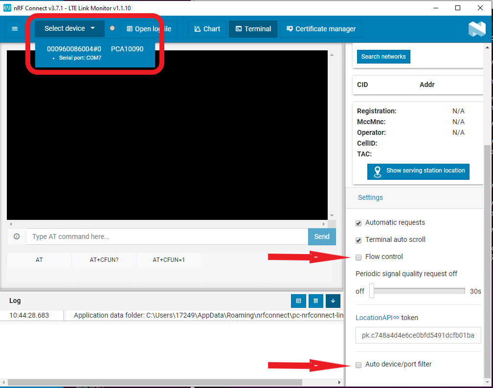

We have tested the nRF91 with the following carriers internally:
* Hologram 
* Soracom
* Verizon M2M

First, build and flash the at_client example to your nrf9160 board with the following commands:

```
west build -p auto -b nrf9160dk_nrf9160_ns nrf/samples/nrf9160/at_client
west flash
```

Insert activated SIM into the nrf9160 board and follow the instructions from [Nordic](https://infocenter.nordicsemi.com/index.jsp?topic=%2Fug_link_monitor%2FUG%2Flink_monitor%2Flm_intro.html) to download and install the LTE Monitor application

With the LTE Montior appication open, power on the nrf9160 board and select from the drop-down menu near the top of the window.  Also, uncheck Flow control and Auto device/port filter:



Test connectivity by pressing the AT+CFUN? button on the LTE Link Montior application.  Serial output will stream to the Monitor application.  Verify that the board has connected through the SIM portal of the SIM being tested.  If the SIM reports that it has connected then the board and SIM are ready to proceed with Golioth application examples.

:::note
Thanks goes to Jared Wolff for the LTE Montitor technique.  You can read the original work at:
https://www.jaredwolff.com/the-nrf9160-feather-connects/
:::

