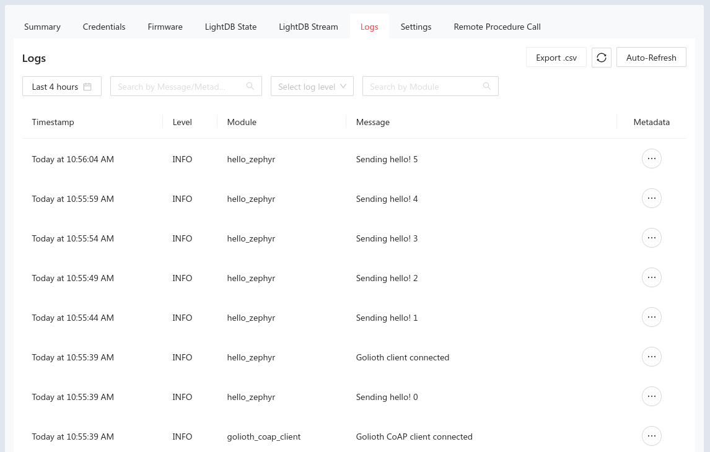

## Install Dependencies and West

import SetupZephyr from '/docs/_partials-common/zephyr-setup-dependencies.md'

<SetupZephyr workspace_directory="golioth-zephyr-workspace"/>

## Install Golioth Firmware SDK

import InstallZephyrSDK from '/docs/_partials-common/zephyr-install-golioth-firmware-sdk.md'

<InstallZephyrSDK/>

## Toolchain check

import CheckToolchain from './\_partials/check-toolchain.md'

<CheckToolchain/>

## Build for Native Simulator
2-zephyr-quickstart/4-simulating-devices-native-sim.md

At this point, you can build a Golioth Zephyr project:

```
west build -b native_sim/native/64 samples/hello -p
```

and run it:

```
./build/zephyr/zephyr.exe
```

The program will create a pseudo-terminal and print its name (e.g.):

```
uart connected to pseudotty: /dev/pts/1
```

You can use `screen` or a similar program of your choice to connect to the
interactive shell:

```
screen /dev/pts/1
```

## Setting Credentials

You must set Golioth credentials for the example to authenticate with Golioth. The
SDK samples store credentials in the Zephyr Settings subsystem, and these can be set
through the shell:

```console
uart:~$ settings set golioth/psk-id <YOUR-PSK-ID>
uart:~$ settings set golioth/psk <YOUR-PSK>
```

<details>
  <summary>How to find credentials</summary>


* Golioth credentials are available in the `Credentials` tab for your device
    * Open the Golioth Console
    * Select `Devices` on  the left sidebar and choose your device from the
      resulting list
    * Click on the `Credentials` tab and copy your `PSK-ID` and `PSK`
</details>

For more on networking, see [the native_sim page on the Zephyr Docs](https://docs.zephyrproject.org/latest/connectivity/networking/native_sim_setup.html)


## Example Output

After setting credentials, you can view program output either in the
pseudo-terminal or on stdout. It should look similar to the following:

```console
WARNING: Using a test - not safe - entropy source
uart connected to pseudotty: /dev/pts/1
*** Booting Zephyr OS build 7823374e8721 ***
*** Golioth Firmware SDK v0.17.0-65-g3634d7e1d392 ***
[00:00:00.000,000] <inf> golioth_settings_autoload: Initializing settings subsystem
[00:00:00.000,000] <inf> fs_nvs: 4 Sectors of 4096 bytes
[00:00:00.000,000] <inf> fs_nvs: alloc wra: 0, fb0
[00:00:00.000,000] <inf> fs_nvs: data wra: 0, 6d
[00:00:00.000,000] <inf> golioth_settings_autoload: Loading settings
[00:00:00.000,000] <inf> net_config: Initializing network
[00:00:00.000,000] <inf> net_config: IPv4 address: 192.0.2.1
[00:00:00.000,000] <dbg> hello_zephyr: main: start hello sample
[00:00:00.000,000] <inf> golioth_mbox: Mbox created, bufsize: 1848, num_items: 10, item_size: 168
[00:00:00.320,003] <inf> golioth_coap_client_zephyr: Golioth CoAP client connected
[00:00:00.320,003] <inf> hello_zephyr: Sending hello! 0
[00:00:00.320,003] <inf> hello_zephyr: Golioth client connected
[00:00:00.320,003] <inf> golioth_coap_client_zephyr: Entering CoAP I/O loop
[00:00:05.330,000] <inf> hello_zephyr: Sending hello! 1
[00:00:10.340,000] <inf> hello_zephyr: Sending hello! 2

```

You can confirm this connection by viewing the Status section of the summary
page for your device in the Golioth web console. You will also see the hello
messages listed in the Log tab:



## Additional Golioth Example Code

Congratulations on running the Hello app! The same process may be used to run
[other Golioth example
applications](https://github.com/golioth/golioth-firmware-sdk/tree/main/examples/zephyr).
Be sure to reference the README file for each for detailed configuration and
usage information.

* **certificate_provisioning:** Use certificate authentication
* **firmware_update:** Use Golioth over-the-air (OTA) firmware update
* **hello:** Connect and send hello logging messages
* **lightdb:** Set, get, and observe stateful data between device and cloud
* **location:** Use network information to determine device location
* **logging:** Demonstrate logging messages of each different log level
* **rpc:** Issue a remote procedure call (rpc) and received data back from device
* **settings:** Demonstrate fleet-wide device settings service
* **stream:** Send time-series data from device to cloud
